<!-- more -->

# Docker学习笔记

## 相关网站

[Docker中文官方网站](http://docker.p2hp.com/)

[Docker仓库](https://hub.docker.com/)

[尚硅谷Docker教学](https://www.bilibili.com/video/BV1gr4y1U7CY/)

[CentOS安装DockerEngine](https://docs.docker.com/engine/install/centos/)

[阿里云镜像加速器](https://cr.console.aliyun.com/cn-hangzhou/instances/mirrors)

[阿里云镜像仓库地址](https://cr.console.aliyun.com/cn-hangzhou/instance/dashboard)

[Dockerfile构建资料](https://docs.docker.com/engine/reference/builder/)

[Docker-compose官方资料](https://docs.docker.com/compose/)

[portainer官网](https://www.portainer.io/)

[Portainer安装文档](https://docs.portainer.io/start/install-ce/server/docker/linux)

## 简介

Docker是基于Go语言实现的云开源项目，能实现只需要一次配置环境，换到别的机子上就可以一键部署好，大大的简化了操作。也就是**一次镜像，处处运行**。

解决了运行环境和配置问题的软件容器，方便做持续集成并有助于整体发布的容器虚拟化技术。

### 基本组成

1. 镜像：类似于java中的类；是一个只读模版，用来常见Docker容器，一个镜像可以创建多个容器。
2. 容器：类似于java中的对象；容器是用镜像创建的运行实例，每个容器都是相互隔离的、保证安全的。
3. 仓库：类似于java中的maven仓库；存储docker镜像的地方，仓库分为共有和私有。

## 安装

### 卸载旧版本

```
sudo yum remove docker \
                  docker-client \
                  docker-client-latest \
                  docker-common \
                  docker-latest \
                  docker-latest-logrotate \
                  docker-logrotate \
                  docker-engine
```

### 安装 yum-util并设置仓库地址

```
sudo yum install -y yum-utils
sudo yum-config-manager \
    --add-repo \
    http://mirrors.aliyun.com/docker-ce/linux/centos/docker-ce.repo
# 更新yum软件包索引
yum makecache fast(centos8 没有fast参数，去掉即可)
yum makecache
```

### 安装Docker Engine

安装最新版本

```shell
sudo yum install docker-ce docker-ce-cli containerd.io docker-buildx-plugin docker-compose-plugin
```

安装指定版本

```
yum list docker-ce --showduplicates | sort -r
 
sudo yum install docker-ce-<VERSION_STRING> docker-ce-cli-<VERSION_STRING> containerd.io docker-buildx-plugin docker-compose-plugin
```

### 启动Docker

```
sudo systemctl start docker
```

### 验证Docker安装成功

```
sudo docker version
sudo docker run hello-world
```

## 卸载

### 卸载Docker

```
sudo systemctl stop docker
yum remove docker-ce docker-ce-cli containerd.io
```

### 删除资源

```
rm -rf /var/lib/docker
rm -rf /var/lib/containerd
```

## 镜像加速器配置(阿里云)

[阿里云镜像加速配置](https://cr.console.aliyun.com/cn-hangzhou/instances/mirrors)

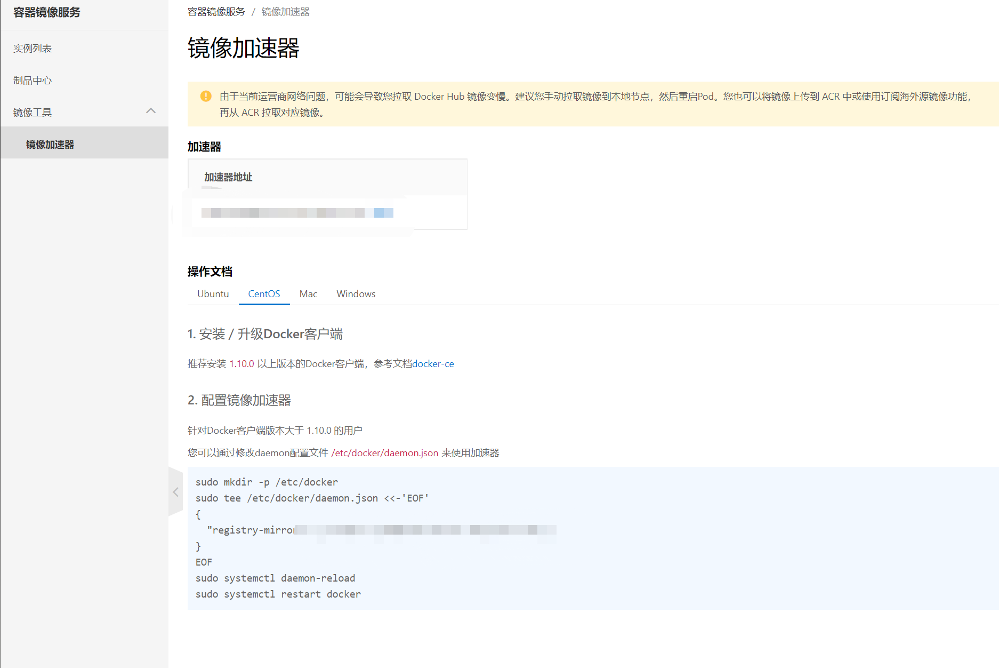

## 常用命令

### 帮助启动类命令

|          功能          |           命令           |
| :--------------------: | :----------------------: |
|       启动Docker       |  systemctl start docker  |
|       停止Docker       |  systemctl stop docker   |
|       重启Docker       | systemctl restart docker |
|     查看Docker状态     | systemctl status docker  |
|        开机启动        | systemctl enable docker  |
|   查看Docker概要信息   |       docker info        |
| 查看Docker总体帮助文档 |      docker --help       |
| 查看Docker命令帮助文档 |  docker 具体命令 --help  |

### 镜像命令

|         功能         |         命令         |
| :------------------: | :------------------: |
| 查看本地主机上的镜像 | docker images  -a*(列出本地所有镜像，包含历史镜像)* -q*(只显示镜像ID)* |
| 搜索镜像 | docker search [镜像名称] --limit [数量] *(展示条数)* |
| 拉取镜像 | docker pull [镜像名字[:TAG]] *(不加tag就是拉取最新的)* |
| 查看镜像/容器/数据卷所占的空间 | docker system df |
| 删除某个或多个镜像 | docker rmi  [-f *(强制删除)* ] [镜像ID/镜像名称:TAG] [镜像ID/镜像名称:TAG] ... |
| 删除所有镜像 | docker rmi -f $(docker images -qa) |

### 容器命令

|            功能            |                             命令                             |
| :------------------------: | :----------------------------------------------------------: |
|       新建+启动容器        | docker run [OPTIONS] 镜像名称 [COMMAND] [ARG...]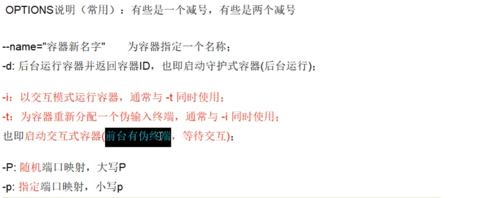 |
| 列出当前所有正在运行的容器 | docker ps [OPTIONS]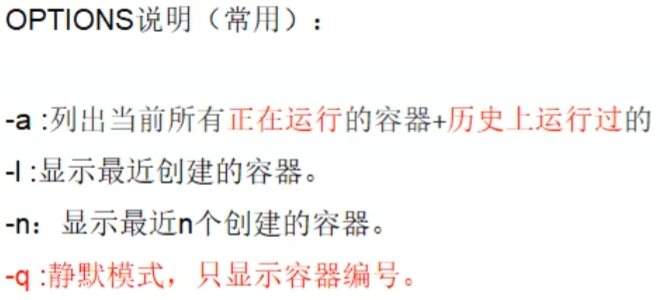 |
|          退出容器          | 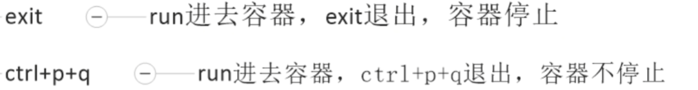 |
|    启动已停止运行的容器    |               docker start 容器ID或者容器名字                |
|          重启容器          |              docker restart 容器ID或者容器名字               |
|          停止容器          |                docker stop 容器ID或者容器名字                |
|        强制停止容器        |                docker kill 容器ID或者容器名字                |
|       删除已停止容器       |              docker rm [-f] 容器ID或者容器名字               |

### 重要指令

|               功能               |                             命令                             |
| :------------------------------: | :----------------------------------------------------------: |
|           查看容器日志           |          docker log  [-f(实时查看)] 容器ID/容器名称          |
|       查看容器内运行的进程       |                  docker top 容器ID/容器名称                  |
|         查看容器内部细节         |                docker inspect 容器ID/容器名称                |
| 进入正在运行的容器并以命令行交互 |               docker exec -it 容器ID /bin/bash               |
|     从容器内拷贝文件到主机上     |              docker cp 容器ID:容器路径 本机路径              |
|          导入和导出容器          | cat 文件名.tar \| docker import -镜像用户/镜像名:镜像版本号/docker export 容器ID > 文件名.tar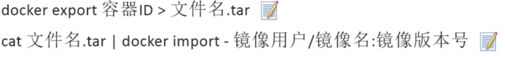 |

## 构建自己的镜像

### 启动ubuntu容器

```
docker run -it ubuntu /bin/bash
```

### 添加vim

```
apt update
apt install vim
```

### 创建含有vim功能的ubuntu的镜像

```
docker commit -m="带有vim功能的ubuntu" -a="xxx" 容器ID 镜像名称[:版本号]
```

## 本地镜像发布到阿里云

[阿里云镜像仓库地址](https://cr.console.aliyun.com/cn-hangzhou/instance/dashboard)

### 创建命名空间

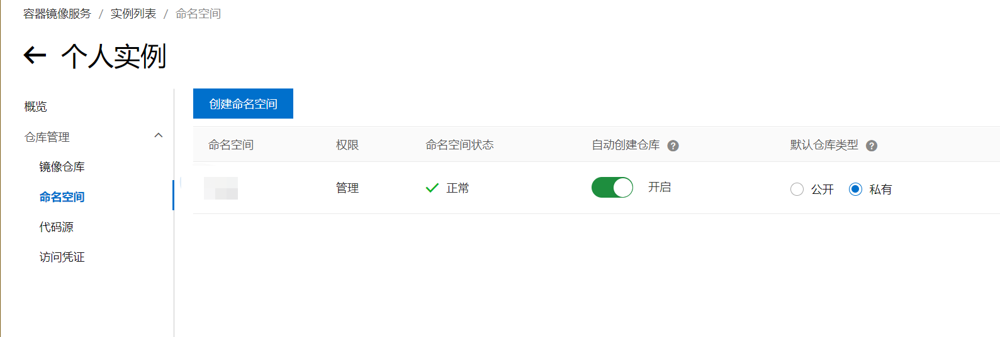

### 创建仓库

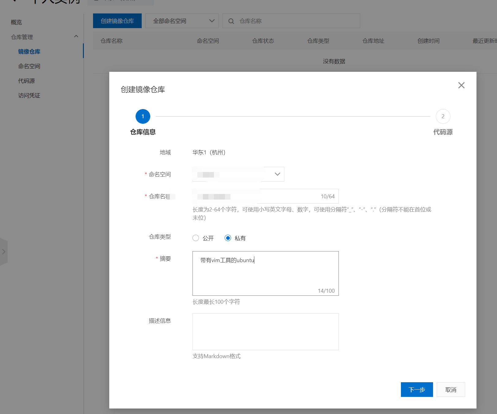

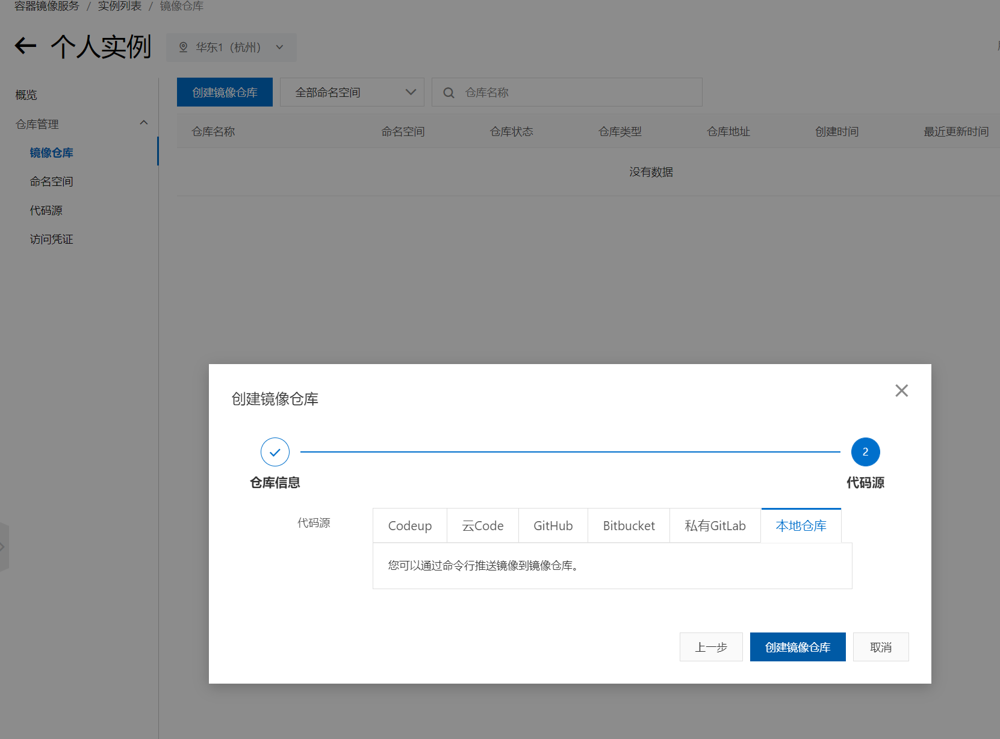

之后按照阿里云提示的命令进行操作

## 私有库安装&本地镜像推送到私有库

### 下载Docker Registry镜像

```
docker pull registry
```

### 运行镜像

```
docker run -d -p 5000:5000 -v /root/myregistry:/tmp/registry --privileged=true registry
```

### 设置私有库支持http

```
cat /etc/docker/daemon.json
```

新增如下配置:

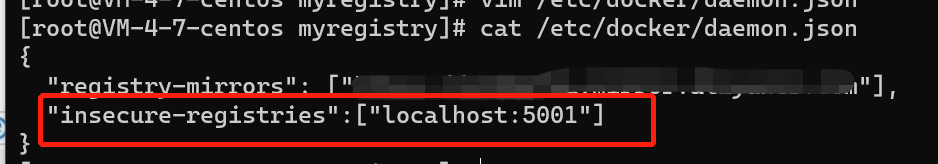

### 查看私有库的镜像列表

```
curl -XGET http://localhost:5000/v2/_catalog
```

### 推送本地镜像到私有库

```sh
docker tag localhost/vim-ubuntu localhost:5000/vim-ubuntu
docker push localhost:5000/vim-ubuntu:latest
```

## 容器数据卷

### 注意点

- 在命令后面建议加上–privileged=true，解决CentOS系统中cannot open directory.：Permission denied 问题

### 作用

主要是将容器内的数据保存在宿主机中，即使容器停止或者删除，容器卷映射的目录也还是存在

### 特点

- 数据卷可在容器之间共享或重用数据
- 卷中的更改可以直接实时生效
- 数据卷中的更改不会包含在镜像的更新中
- 数据卷的声明周期一直持续到没有容器使用它位置

### 挂载命令

```shell
docker run -d --privileged=true -v 宿主机目录:容器目录:ro(默认是rw，有读写权限) 容器ID/容器名
```

### 容器卷的继承

```shell
docker run -d --privileged=true --volumes-from 父容器ID 容器ID/容器名
```

## 安装常用软件

### Tomcat

```shell
docker search tomcat
docker pull tomcat
docker run -d -p 8080:8080 --name=tomcat tomcat
```

### nginx

```
docker run --name nginx \
  -v /root/custom_data/nginx/nginx.conf:/etc/nginx/nginx.conf:ro \
  --privileged=true \
  -d \
  nginx
```

### Mysql

```sh
docker run -d -p 3306:3306 \
  -e MYSQL_ROOT_PASSWORD=123456 \
  -v /root/custom_data/mysql/conf:/etc/mysql/conf.d \
  -v /root/custom_data/mysql/data:/var/log/mysql \
  -v /root/custom_data/mysql/log:/var/lib/mysql \
  --privileged=true \
  --name mysql  \
  mysql \
  --character-set-server=utf8mb4 --collation-server=utf8mb4_unicode_ci
```

### redis

```
docker run \
    -v /root/custom_data/redis/conf:/usr/local/etc/redis \
    -v /root/custom_data/redis/data:/data \
    -d \
    --name redis \
    --privileged=true \
    redis \
    redis-server /usr/local/etc/redis/redis.conf
```

#### 分布式存储解决方案

1. Hash取余分区：缺点是如果一台redis挂了或者扩容缩容，那么hash(key) % redis机器台数  计算出来的值就会发生很大变化
2. 一致性哈希算法分区：缺点是如果节点太少，容易因为节点分布不均匀而造成数据倾斜的问题(被缓存的对象大部分落在同一台主机上)
3. 哈希槽分区

## Dockerfile

[Dockerfile构建资料](https://docs.docker.com/engine/reference/builder/)

### 简介

Dockerfile是用来构建镜像的一个文本文件，是由一条条构建镜像所需的指令和参数构成的脚本

### 构建步骤

1. 编写Dockerfile文件
2. docker build 命令构建镜像
3. docker run 镜像运行容器实例

### 构建过程

#### 基础知识

1. 每条保留字指令都**必须为大写字母**且后面要跟随至少一个参数
2. 指令按照从上到下，顺序执行
3. #表示注释
4. 每条指令都会创建一个新的镜像层并对镜像进行提交

#### 执行流程

1. docker 从基础镜像运行一个容器
2. 执行一条指令并对容器做出修改
3. 执行类似docker commit的操作提交一个新的镜像层
4. docker 再基于刚提交的净吸纳过运行一个新容器
5. 执行dockerfile中的下一条指令直到左右的指令都执行完成

### 常用保留字

- FROM

  基础镜像，当前新镜像是基于哪个镜像的，指定一个已经存在的镜像作为模版，第一条必须是FROM

- MAINTAINER

  镜像维护者的姓名和邮箱地址

- RUN

  容器构建时需要运行的命令，是在docker build 时运行 ，分为两种:

  ​	shell 格式 ： 类似于在终端bash中运行的命令，例如： RUN yum -y install vim

  ​	exec 格式 ： RUN ["可执行文件","参数1", “参数2”] ， 例如: RUN ["./test.php", “dev”, “offline”] 等价于 RUN ./test.php dev offline

- EXPOSE

  当前容器对外暴露的端口

- WORKDIR

  指定在创建容器后，终端默认登录的进来工作目录，一个落脚点

- USER

  指定该镜像以什么样的用户去执行，如果不指定，默认为root

- ENV

  用来在构建过程中设置环境变量，这个环境变量可以在后续的任何RUN指令中使用，引用方式 $XXX

- ADD

  将宿主机目录下的文件拷贝进镜像且会自动处理URL和解压tar压缩包

- COPY

  类似ADD，但是没有自动解压功能，将宿主机中的数据拷贝到镜像中，COPY src dest / COPY ["src", “dest”]

- VOLUME

  容器数据卷，用于数据保存和持久化工作

- CMD

  指定容器启动后要执行的命令，是在docker run 时运行， 和RUN 语法一样，如果一个文件有多个CMD 命令，那么只执行最后一个，并且会被docker run 命令 [参数] 最后的参数给替换

- ENTRYPOINT

  用来指定一个容器启动时要运行的命令，类似于CMD命令，但是ENTRYPOINT不会被docker run 后面的命令覆盖，而且这些命令行参数会被当做参数送给ENTRYPOINT指令指定的程序。

## 虚悬镜像

仓库名和tag名都为&lt;none&gt; 的镜像

### 查询虚悬镜像

```
docker image ls -f dangling=true
```

### 删除虚悬镜像

```
docker image prune
```

## Docker网络

docker 启动后会有一个docker0 的网络 

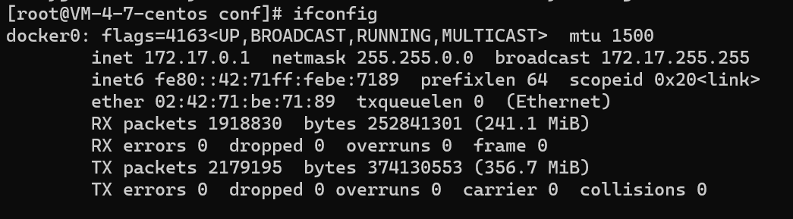

当安装docker 后，会默认安装3个网络模式

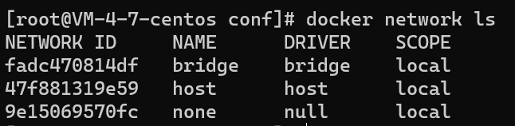

### 相关命令

```
docker network [OPTIONS]
```

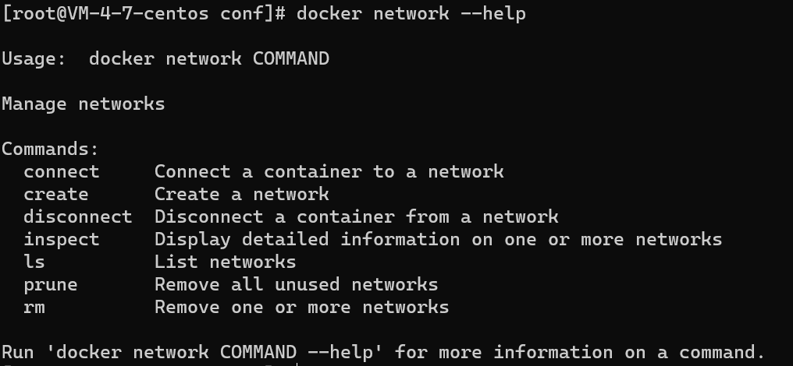

### 作用

1. 容器间的互联和通信以及端口映射
2. 容器IP变动时可以通过服务名直接网络通信而不受到IP变动的影响

### 网络模式的介绍

| 网络模式  | 简介                                                         |
| --------- | ------------------------------------------------------------ |
| bridge    | 为每一个容器分配、设置IP等，并将容器连接到一个**docker0**虚拟网桥，默认为该模式。**使用--network bridge指定** |
| host      | 容器将不会虚拟出自己的网卡，配置自己的IP等，而是使用宿主机的IP和端口。**使用 --network host 指定** |
| none      | 容器有独立的Netwok namespace，但并没有对其进行任何网络设置，如分配veth pair和网桥连接，IP等。**使用--network none指定** |
| container | 新创建的容器不会创建自己的网卡和配置自己的IP，而是和一个指定的容器共享IP、端口范围等。**使用 --network container:NAME或者容器ID指定** |

### 自定义网络

解决了只能用IP通信的问题，可以用服务名通信，如下步骤实现：

1. 创建自定义网络 docker network create customer_network
2. 新建容器加入自定义网络; docker run --network customer_network 容器名

## Docker-compose 容器编排

[Docker-compose官方资料](https://docs.docker.com/compose/)

是Docker 是官方的开源项目，实现对Docker容器集群的快速编排。编写一个docker-compose.yml文件，在其中定义各个容器的关系，就可以用一条指令来一键启动或者关闭这些容器。

### 安装

```sh
curl -SL https://github.com/docker/compose/releases/download/v2.17.2/docker-compose-linux-x86_64 -o /usr/local/bin/docker-compose
sudo ln -s /usr/local/bin/docker-compose /usr/bin/docker-compose
#测试是否安装成功
docker compose version
```

### compose核心概念

- 一文件: docker-compose.yml

- 两要素: 

​		服务：一个个应用容器实例，比如订单微服务，mysql容器，redis等

​		工程：由一组关联的应用容器组成的一个**完整业务单元**，在docker-compose.yml文件中定义

### 使用步骤

1. 编写Dockerfile定义各个微服务应用并构建出对应的镜像文件
2. 使用docker-compose.yml定义一个完整业务单元，安排好整体应用中的各个容器服务。
3. 最后，执行docker-compose up命令来启动并运行整个应用程序，完成一键部署上线

### 常用命令

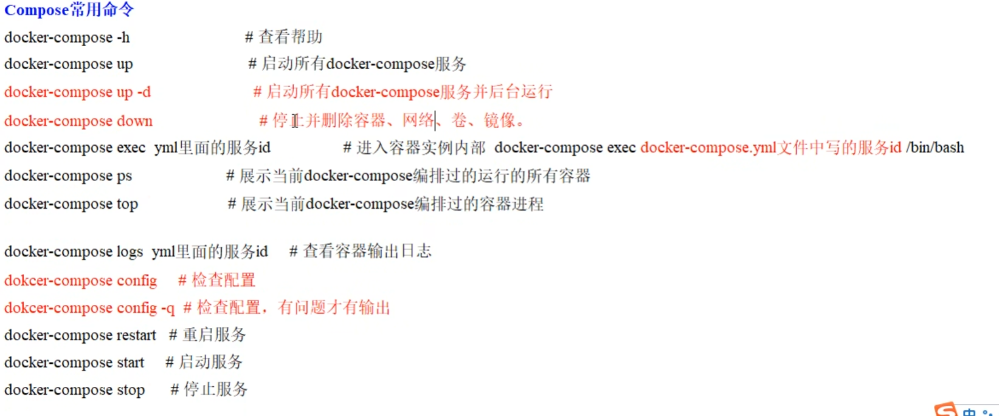

## Portainer可视化工具

[portainer官网](https://www.portainer.io/)

[Portainer安装文档](https://docs.portainer.io/start/install-ce/server/docker/linux)

### 介绍

Portainer是一个可视化docker操作工具，可以不用写docker命令实现容器的生命周期进行管理，方便的实现容器的创建、运行、停止、暂停、恢复、删除、复制等。

#### 安装

```
docker run -d -p 8000:8000 -p 9443:9443 --name portainer --restart=always -v /var/run/docker.sock:/var/run/docker.sock -v portainer_data:/data portainer/portainer-ce:latest
```

## Docker容器监控CIG(CAdvisor+InfluxDB+Granfana)

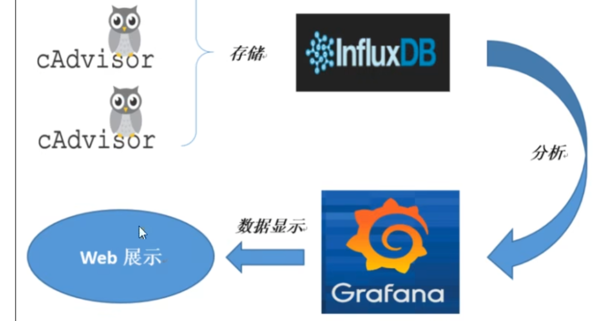

### CAdvisor

CAdvisor 是一个容器资源监控工具，包括容器的内存，CPU，网络IO，磁盘IO等监控，同时提供了一个web页面用于查看容器的实施运行状态。CAdvisor默认存储2分钟的数据，而且只是针对单物理机。不过CAdvisor提供了很多数据集成接口，支持InfluxDB,Redis,Kafka，ES等集成，可以加上对应配置将监控数据发往这些数据库存储起来

主要功能：

	- 展示Host和容器两个层次的监控数据
	- 展示历史变化数据

### InfluxDB

是用Go语言编写的一个开源分布式时序、事件和指标数据库，无需外部依赖。

主要功能：

	- 基于时间序列，支持与时间有关的相关函数(如最大、最小、求和等)
	- 可度量性： 你可以实时对大量数据进行计算
	- 基于事件： 它支持任意的时间数据

### Granfana

是一个开源的数据监控分析可视化平台，支持多种数据源配置和丰富的插件及末班功能，支持图标权限控制和报警。

主要特性：

	- 灵活丰富的图形化选项
	- 可以混合多种风格
	- 支持白天和夜间模式
	- 多个数据源

### 使用docker-compose安装CIG

```yml
version: '3.1'
volumes:
  grafana_data: {}

services:
 influxdb:
   image: tutum/influxdb:0.9
   restart: always
   environment:
   - PRE_CREATE_DB=cadvisor
   ports:
   - "8083:8083"
   - "8086:8086"
   volumes:
   - ./data/influxdb:/data
             
 cadvisor:
   image: google/cadvisor
   links:
   - influxdb:influxsrv
   command: -storage_driver=influxdb -storage_driver_db=cadvisor -storage_driver_host=influxsrv:8086
   restart: always
   ports:
   - "8080:8080"
   volumes:
   - /:/rootfs:ro
   - /var/run:/var/run:rw
   - /sys:/sys:ro
   - /var/lib/docker/:/var/lib/docker:ro
 grafana:
   user: "104"
   image: grafana/grafana
   user: "104"
   restart: always
   links:
    - influxdb:influxsrv
   ports:
    - "3000:3000"
   volumes:
    - grafana_data:/var/lib/grafana
   environment:
    - HTTP_USER=admin
    - HTTP_PASS=admin
    - INFLUXDB_HOST=influxsrv
    - INFLUXDB_PORT=8086
    - INFLUXDB_NAME=cadvisor
    - INFLUXDB_USER=root
    - INFLUXDB_PASS=root

```

