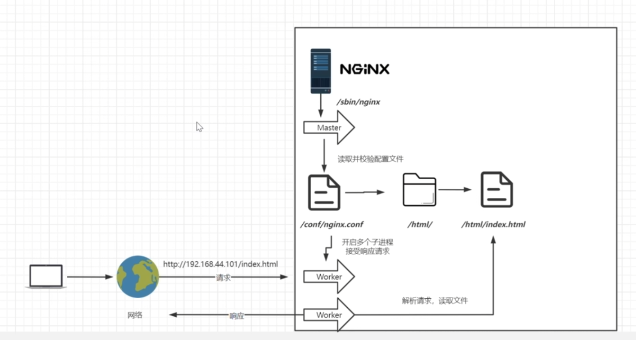
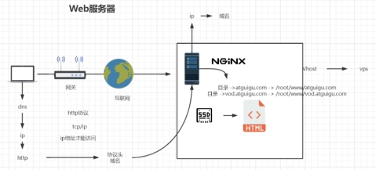
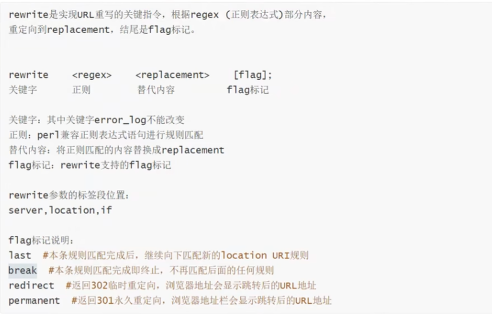

<!-- more -->

# Nginx学习笔记

## 常用版本

Nginx开源版（官方免费开源版本）
http://nginx.org/

Nginx plus 商业版（付费版，在上版本基础上加了一些功能）
https://www.nginx.com

openresty（nginx+lua完美整合）
http://openresty.org/cn/

Tengine（淘宝网公布发行版本，免费开源）
http://tengine.taobao.org

## Docker安装

先创建挂在目录和复制配置

```sh
docker run --name nginx -d nginx

# 将容器nginx.conf文件复制到宿主机
docker cp nginx:/etc/nginx/nginx.conf /mydata/nginx/conf/nginx.conf
# 将容器conf.d文件夹下内容复制到宿主机
docker cp nginx:/etc/nginx/conf.d /mydata/nginx/conf/conf.d
# 将容器中的html文件夹复制到宿主机
docker cp nginx:/usr/share/nginx/html /mydata/nginx

```

```sh
docker run \
-p 80:80 \
--name nginx \
-v /mydata/nginx/conf/nginx.conf:/etc/nginx/nginx.conf \
-v /mydata/nginx/conf/conf.d:/etc/nginx/conf.d \
-v /mydata/nginx/log:/var/log/nginx \
-v /mydata/nginx/html:/usr/share/nginx/html \
-d nginx:latest
```

## 安装文件目录

- conf

  主要存放nginx的配置文件

- html

  存放一些静态文件

- logs

  存放nginx 的日志

## 工作流程



## Nginx.conf最小配置

```sh
# nginx启动的时候启动多少个工作进程,基本一个内核对应多少个
worker_processes  auto;

events {
    # 最大连接数
    worker_connections  1024;
}

http {
    # 引入其他配置文件
    include       /etc/nginx/mime.types; # 该文件记录头类型
    # 默认类型，如果不包含在默认的头类型就用这个默认的
    default_type  application/octet-stream;

    log_format  main  '$remote_addr - $remote_user [$time_local] "$request" '
                      '$status $body_bytes_sent "$http_referer" '
                      '"$http_user_agent" "$http_x_forwarded_for"';

    access_log  /var/log/nginx/access.log  main;
    # 数据零拷贝: 不通过应用内存发送文件流
    sendfile        on;
    #tcp_nopush     on;
    # 保持长连接的超时时间
    keepalive_timeout  65;

    #gzip  on;
    # 虚拟主机
    server {
        # 监听端口
        listen       80;
        listen  [::]:80;
        # 域名、主机名
        server_name  localhost;
        # uri
        location / {
            # 资源的根目录
            root   /usr/share/nginx/html;
            # 默认页
            index  index.html index.htm;
        }
        # 错误码转发到地址
        error_page   500 502 503 504  /50x.html;
        location = /50x.html {
            root   /usr/share/nginx/html;
        }
    }
}
```

## 虚拟主机



### 域名解析

解析的就是将域名与IP进行绑定映射。

#### 解析方式

A： 将域名匹配一个IPV4的地址。（常用）

CNAME： 将域名指向到另外的一个域名（常用）

AAA：将域名指向一个IPV6的地址

...

### ServerName匹配规则

**server块匹配是按照顺序的，如果前一个匹配上了，就不会匹配后面的了**

server_name编写规则：

- 完整匹配

  server_name h1,h2;

- 通配符匹配

  *号匹配：server_name *.xxx.com

- 通配符结束匹配

  server_name www.xxx.*

- 正则匹配

  server_name ~^[0-9]+\.xxx\.com$;

## 反向代理

### proxy_pass

示例:

```
server {
    listen       80;
    listen  [::]:80;
    server_name  localhost;

    #access_log  /var/log/nginx/host.access.log  main;
    location / {
        proxy_pass http://www.atguigu.com;
    }
    error_page   500 502 503 504  /50x.html;
    location = /50x.html {
        root   /usr/share/nginx/html;
    }
}
```

注意:

 proxy_pass 里面不能代理https

## 负载均衡

### upstream

```
upstream httpds{
 server 代理1;
 server 代理2;
 server 代理3;
}
server {
    listen       80;
    listen  [::]:80;
    server_name  localhost;

    #access_log  /var/log/nginx/host.access.log  main;
    location / {
        proxy_pass httpds;
    }
    error_page   500 502 503 504  /50x.html;
    location = /50x.html {
        root   /usr/share/nginx/html;
    }
}
```

### 负载策略

- 轮询：一台机器一次

- 权重：根据权重来判断代理到哪台服务器

  ```
  upstream httpds{
   server 代理1 weight=8 down; # down 表示该机器不参与负载均衡
   server 代理2 weight=5; 
   server 代理3 weight=1 backup;# backup 表示正常情况下不会负载到该台机器，只有当没有机器能够使用才会负载到这台机器
  }
  ```

- ip_hash

  根据客户端的ip的地址判断负载到某一台固定的机器，可以保持会话

- least_conn

  最少连接访问，多给最少的机器连接

- url_hash

  根据用户访问的url定向转发请求【需要加载附加组件才可以实现】

- fair

  根据后端服务器响应时间转发请求【需要加载附加组件才可以实现】

## 动静分离

```
worker_processes  1;
events {
    worker_connections  1024;
}
http {
    include       mime.types;
    default_type  application/octet-stream;
    sendfile        on;
    keepalive_timeout  65;
    server {
        listen       80;
        server_name  localhost;
        location / {
	    proxy_pass http://192.168.73.203:8080;
        }
        location ~*/(js|css|images) {
	    root html;
	    index index.html index.htm;
        }
        error_page   500 502 503 504  /50x.html;
        location = /50x.html {
            root   html;
        }
    }
}
```

## URLRewirte伪静态配置

### rewrite

```
server {
    listen       80;
    listen  [::]:80;
    server_name  localhost;

    #access_log  /var/log/nginx/host.access.log  main;
    location / {
        rewrite ^/.html$ /index.jsp?pageNum=2 break;
        proxy_pass http://www.atguigu.com;
    }
    error_page   500 502 503 504  /50x.html;
    location = /50x.html {
        root   /usr/share/nginx/html;
    }
}
```

### 命令形式：



## 防盗链

### valid_refers

检测来源网址

## 高可用配置

### 运用keepalived 实现

#### 安装

```sh
yum install -y keepalived
```

安装完成后配置文件在  /etc/keepalived/keepalived.conf 

#### 配置文件

```sh
! Configuration File for keepalived
#Keepalived配置文件
global_defs {
        router_id NodeA                 #路由ID, 主备的ID不能相同
}
#自定义监控脚本
vrrp_script chk_haproxy {
        script "/etc/keepalived/check_haproxy.sh"
        interval 5
        weight 2
}
vrrp_instance VI_1 {
        state MASTER #Keepalived的角色。Master表示主服务器，从服务器设置为BACKUP
        interface eth0          #指定监测网卡
        virtual_router_id 1
        priority 100            #优先级，BACKUP机器上的优先级要小于这个值
        advert_int 1            #设置主备之间的检查时间，单位为s
        authentication {        #定义验证类型和密码
                auth_type PASS
                auth_pass root123
        }
        track_script {
                chk_haproxy
        }
        virtual_ipaddress {     #VIP地址，可以设置多个：
                1.117.149.141
        }
}
```

## Https 证书

// todo

```
server {
   listen 443 ssl;
   server_name 域名;
   ssl_certificate pem文件地址;
   ssl_certificate_key key文件地址;
}
```


