<!-- more -->

# RabbitMQ学习笔记

## 相关网站

[尚硅谷RabbitMQ学习视频](https://www.bilibili.com/video/BV1cb4y1o7zz/)

[RabbitMQ官网](https://www.rabbitmq.com/)

[RabbitMQ安装DOC](https://www.rabbitmq.com/download.html)

[RabbitMQ-崔二旦](https://blog.csdn.net/cuierdan/category_11721744.html)

## 使用MQ的好处

1. **项目解耦**：不同的项目或模块可以使用消息中间件进行数据的传递，从而可以保证模块的相对独立，实现解耦。
2. **流量削峰**：可以将突发的流量 (如秒杀数据) 写入消息中间件，然后由多个消费者进行异步处理。
3. **弹性伸缩**：可以通过对消息中间件进行横向扩展来提高系统的处理能力和吞吐量。
4. **发布订阅**：可以用于任意的发布订阅模式中。
5. **异步处理**：当我们不需要对数据进行立即处理，或者不关心数据的处理结果时，可以使用中间件进行异步处理。
6. **冗余存储**：消息中间件可以对数据进行持久化存储，直到你消费完成后再进行删除。

## MQ的分类

| MQ种类   | 优点                                                         | 缺点                                                         | 使用场景                                                     |
| -------- | ------------------------------------------------------------ | ------------------------------------------------------------ | ------------------------------------------------------------ |
| ActiveMQ | 单机吞吐量万级，时效性 ms 级，可用性高，基于主从架构实现高可用性，消息可靠性较低的概率丢失数据 | 官方社区现在对 ActiveMQ 5.x 维护越来越少，高吞吐量场景较少使用。 | ActiveMQ支持任何消息传递用例的能力和灵活性,**比较适合小型吞吐量比较小的公司进行使用,或者MQ起步学习的首选。** |
| Kafka    | 性能卓越，单机写入TPS 约在百万条/秒，最大的优点，就是吞吐量高。时效性 ms 级可用性非常高，kafka 是分布式的，一个数据多个副本，少数机器宕机，不会丢失数据，不会导致不可用,消费者采用 Pull 方式获取消息, 消息有序, 通过控制能够保证所有消息被消费且仅被消费一次;有优秀的第三方Kafka | Kafka 单机超过 64 个队列/分区，Load 会发生明显的飙高现象，队列越多，load 越高，发送消息响应时间变长，使用短轮询方式，实时性取决于轮询间隔时间，消费失败不支持重试；支持消息顺序，但是一台代理宕机后，就会产生消息乱序，社区更新较慢； | Kafka 主要特点是基于Pull 的模式来处理消息消费，追求高吞吐量，**一开始的目的就是用于日志收集和传输，适合产生大量数据的互联网服务的数据收集业务**。大型公司建议可以选用，大数据分析必备，如果有日志采集功能，肯定是首选 kafka 了。 |
| RocketMQ | 布式的，扩展性好,支持 10 亿级别的消息堆积，不会因为堆积导致性能下降，源码是 java 我们可以自己阅读源码，定制自己公司的 MQ | 支持的客户端语言不多，目前是java及c++，其中c++不成熟，核心中去实现 JMS 等接口,有些系统要迁移需要修改大量代码 | **天生为金融互联网领域而生，对于可靠性要求很高的场景**，尤其是电商里面的订单扣款，以及业务削峰，在大量交易涌入时，后端可能无法及时处理的情况。RoketMQ 在稳定性上可能更值得信赖，这些业务场景在阿里双 11 已经经历了多次考验，如果你的业务有上述并发场景，建议可以选择 RocketMQ。 |
| RabbitMQ | 由于 erlang 语言的高并发特性，性能较好；吞吐量到万级，MQ 功能比较完备,健壮、稳定、易用、跨平台、支持多种语言 如：Python、Ruby、.NET、Java、JMS、C、PHP、ActionScript、XMPP、STOMP等，支持 AJAX 文档齐全；开源提供的管理界面非常棒，用起来很好用,社区活跃度高；更新频率相当高 | 商业版需要收费,学习成本较高                                  | 结合 erlang 语言本身的并发优势，性能好时效性微秒级，社区活跃度也比较高，管理界面用起来十分方便，**如果你的数据量没有那么大，中小型公司优先选择功能比较完备的 RabbitMQ。** |

## 四大核心概念

1. 生产者

   产生数据发送消息的程序

2. 交换机

   是 RabbitMQ 非常重要的一个部件，一方面它接收来自生产者的消息，另一方面它将消息 推送到队列中。交换机必须确切知道如何处理它接收到的消息，是将这些[消息推送](https://so.csdn.net/so/search?q=消息推送&spm=1001.2101.3001.7020)到特定队列还是推送到多个队列，亦或者是把消息丢弃，这个得有交换机类型决定

3. 队列

   是 RabbitMQ 内部使用的一种数据结构，尽管消息流经 RabbitMQ 和应用程序，但它们只能存储在队列中。队列仅受主机的内存和磁盘限制的约束，本质上是一个大的消息缓冲区。许多生产者可以将消息发送到一个队列，许多消费者可以尝试从一个队列接收数据。这就是我们使用队列的方式

4. 消费者

   消费与接收具有相似的含义。消费者大多时候是一个等待接收消息的程序。请注意生产者，消费者和消息中间件很多时候并不在同一机器上。同一个应用程序既可以是生产者又是可以是消费者。

## RabbitMQ 模型架构

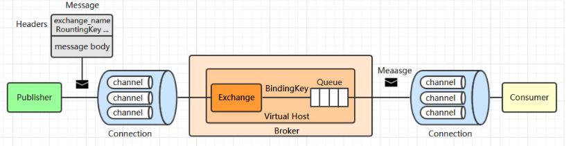

1. Publisher（发布者）

   发布者 (或称为生产者) 负责生产消息并将其投递到指定的交换器上。

2. Message（消息）

   消息由消息头和消息体组成。消息头用于存储与消息相关的元数据：如目标交换器的名字 (exchange_name) 、路由键 (RountingKey) 和其他可选配置 (properties) 信息。消息体为实际需要传递的数据。

3. Exchange（交换器）

   交换器负责接收来自生产者的消息，并将将消息路由到一个或者多个队列中，如果路由不到，则返回给生产者或者直接丢弃，这取决于交换器的 mandatory 属性：

   当 mandatory 为 true 时：如果交换器无法根据自身类型和路由键找到一个符合条件的队列，则会将该消息返回给生产者；

   当 mandatory 为 false 时：如果交换器无法根据自身类型和路由键找到一个符合条件的队列，则会直接丢弃该消息。

4. BindingKey (绑定键）

   交换器与队列通过 BindingKey 建立绑定关系。

5. Routingkey（路由键）

   生产者将消息发给交换器的时候，一般会指定一个 RountingKey，用来指定这个消息的路由规则。当 RountingKey 与 BindingKey 基于交换器类型的规则相匹配时，消息被路由到对应的队列中。

6. Queue（消息队列）

   用于存储路由过来的消息。多个消费者可以订阅同一个消息队列，此时队列会将收到的消息将以轮询 (round-robin) 的方式分发给所有消费者。即每条消息只会发送给一个消费者，不会出现一条消息被多个消费者重复消费的情况。

7. Consumer（消费者）

   消费者订阅感兴趣的队列，并负责消费存储在队列中的消息。为了保证消息能够从队列可靠地到达消费者，RabbitMQ 提供了消息确认机制 (message acknowledgement)，并通过 autoAck 参数来进行控制：

   当 autoAck 为 true 时：此时消息发送出去 (写入TCP套接字) 后就认为消费成功，而不管消费者是否真正消费到这些消息。当 TCP 连接或 channel 因意外而关闭，或者消费者在消费过程之中意外宕机时，对应的消息就丢失。因此这种模式可以提高吞吐量，但会存在数据丢失的风险。

   当 autoAck 为 false 时：需要用户在数据处理完成后进行手动确认，只有用户手动确认完成后，RabbitMQ 才认为这条消息已经被成功处理。这可以保证数据的可靠性投递，但会降低系统的吞吐量。

8. Connection（连接）

   用于传递消息的 TCP 连接。

9. Channel（信道）

   RabbitMQ 采用类似 NIO (非阻塞式 IO ) 的设计，通过 Channel 来复用 TCP 连接，并确保每个 Channel 的隔离性，就像是拥有独立的 Connection 连接。当数据流量不是很大时，采用连接复用技术可以避免创建过多的 TCP 连接而导致昂贵的性能开销。

10. Virtual Host（虚拟主机）

    RabbitMQ 通过虚拟主机来实现逻辑分组和资源隔离，一个虚拟主机就是一个小型的 RabbitMQ 服务器，拥有独立的队列、交换器和绑定关系。用户可以按照不同业务场景建立不同的虚拟主机，虚拟主机之间是完全独立的，你无法将 vhost1 上的交换器与 vhost2 上的队列进行绑定，这可以极大的保证业务之间的隔离性和数据安全。默认的虚拟主机名为 / 。

11. Broker

    一个真实部署运行的 RabbitMQ 服务。


## 安装

[RabbitMQ安装文档](https://www.rabbitmq.com/download.html)

Docker安装：

```sh
docker run -d \
  --name rabbitmq \
  -e RABBITMQ_DEFAULT_USER=test -e RABBITMQ_DEFAULT_PASS=123456 \
  -p 5671:5671 -p 5672:5672 -p 4369:4369 -p 25672:25672 -p 15671:15671 -p 15672:15672 \
  --restart=always \
  rabbitmq:management
```

安装好后通过 15672 端口就能访问到管理页面。

## RabbitMQ工作模式

### HelloWorld - 简单队列模式

#### 介绍

简单队列模式从字面上理解,乍看就是一种非常简单的队列模式,其实实际也是如此,该队列模式分为两种角色,一个是消息生产者,另外一个是消息消费者,最后还有一个队列,俗称点对点模式。

::: details 示例代码
::: tabs
@tab 生产者代码

```java
public class HelloWorld {
    public static final String HELLO_QUEUE = "hello_world";
    public static void main(String[] args) throws IOException, TimeoutException {
        // 创建RabbitMQ连接工厂
        ConnectionFactory connectionFactory = new ConnectionFactory();
        connectionFactory.setHost("");
        connectionFactory.setUsername("");
        connectionFactory.setPassword("");
        // 创建连接
        Connection connection = connectionFactory.newConnection();
        // 获取信道
        Channel channel = connection.createChannel();
        /**
         * 声明一个队列:
         * 1. 队列名称
         * 2. 队列里面的消息是否持久化到磁盘，默认为false，不持久化
         * 3. 该队列是否只提供一个消费者进行消费，是否进行消息共享
         * 4. 最后一个消费者断开连接以后，是否自动删除
         * 5. 其它配置消息
         */
        channel.queueDeclare(HELLO_QUEUE, false,false,false,null);
        /**
         * 发送消息到MQ:
         * 1. 交换机
         * 2. 路由的key，本次是队列名称
         * 3. 其它配置消息
         * 4. 发送的消息体
         */
        String sendMsg = "HelloWorld";
        channel.basicPublish("", HELLO_QUEUE, null, sendMsg.getBytes());
    }
}
```


@tab 消费者代码

```java
public class Consumer {
    public static final String HELLO_QUEUE = "hello_world";
    public static void main(String[] args) throws IOException, TimeoutException {
        // 创建RabbitMQ连接工厂
        ConnectionFactory connectionFactory = new ConnectionFactory();
        connectionFactory.setHost("");
        connectionFactory.setUsername("");
        connectionFactory.setPassword("");
        // 创建连接
        Connection connection = connectionFactory.newConnection();
        // 获取信道
        Channel channel = connection.createChannel();
        /**
         * 消费一个消息:
         * 1. 队列名称
         * 2. 消费成功之后是否自动应答，true为自动应答，false为手动应答
         * 3. 接收消息的回调
         * 4. 消费者取消消费的回调
         */
        String receiveConsumerTag = channel.basicConsume(HELLO_QUEUE, true, (consumerTag, message) -> {
            System.out.println("consumerTag = " + consumerTag);
            System.out.println("message = " + new String(message.getBody()));
        }, (consumerTag) -> {
            System.out.println("consumerTag = " + consumerTag);
        });
        System.out.println("receiveConsumerTag = " + receiveConsumerTag);
    }
}
```

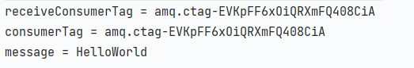

:::

### Work Queues - 工作队列模式

#### 介绍

1. 工作队列模式 也叫 竞争消费者模式

   - 多个消费端消费同一个队列中的消息

   - 队列采用轮询的方式将消息是平均发送给消费者，此处的资源是竞争关系

2. 与简单模式相比 多了一个(或者多个)消费端

3. 它解决了当消息队列的消息过多的情况，单消费者消费速率有限，导致的消息堆积的问题。

4. 工作队列模式中的队列是和默认的交换机 AMQP default 进行绑定(和简单模式一样)

5. 保证同一个消息只能被一个消费者消费掉

   - 可以设置一个开关，syncronize，保证一条消息只能被一个消费者使用

6. 用于场景

   - 红包场景

   - 大型项目中的资源调度

::: details 示例代码
::: tabs
@tab 生产者代码

```java
public class Producer {
    public static final String WORK_QUEUE = "work";
    public static void main(String[] args) throws IOException, TimeoutException {
        // 创建RabbitMQ连接工厂
        ConnectionFactory connectionFactory = new ConnectionFactory();
        connectionFactory.setHost("");
        connectionFactory.setUsername("");
        connectionFactory.setPassword("");
        // 创建连接
        Connection connection = connectionFactory.newConnection();
        // 获取信道
        Channel channel = connection.createChannel();
        /**
         * 声明一个队列:
         * 1. 队列名称
         * 2. 队列里面的消息是否持久化到磁盘，默认为false，不持久化
         * 3. 该队列是否只提供一个消费者进行消费，是否进行消息共享
         * 4. 最后一个消费者断开连接以后，是否自动删除
         * 5. 其它配置消息
         */
        channel.queueDeclare(WORK_QUEUE, false,false,false,null);
        /**
         * 发送消息到MQ:
         * 1. 交换机
         * 2. 路由的key，本次是队列名称
         * 3. 其它配置消息
         * 4. 发送的消息体
         */
        Scanner scanner = new Scanner(System.in);
        while (scanner.hasNext()){
            String msg = scanner.next();
            channel.basicPublish("", WORK_QUEUE, null, msg.getBytes());
        }
    }
}
```

@tab 消费者1代码

```java
public class Worker01 {
    public static final String WORK_QUEUE = "work";
    public static void main(String[] args) throws IOException, TimeoutException {
        // 创建RabbitMQ连接工厂
        ConnectionFactory connectionFactory = new ConnectionFactory();
        connectionFactory.setHost("");
        connectionFactory.setUsername("");
        connectionFactory.setPassword("");
        // 创建连接
        Connection connection = connectionFactory.newConnection();
        // 获取信道
        Channel channel = connection.createChannel();
        // 消费消息
        /**
         * 消费一个消息:
         * 1. 队列名称
         * 2. 消费成功之后是否自动应答，true为自动应答，false为手动应答
         * 3. 接收消息的回调
         * 4. 消费者取消消费的回调
         */
        String receiveConsumerTag = channel.basicConsume(WORK_QUEUE, true, (consumerTag, message) -> {
            System.out.println("consumerTag = " + consumerTag);
            System.out.println("message = " + new String(message.getBody()));
        }, (consumerTag) -> {
            System.out.println("consumerTag = " + consumerTag);
        });
        System.out.println("receiveConsumerTag = " + receiveConsumerTag);
    }
}
```

@tab 消费者2代码

```java
public class Worker01 {
    public static final String WORK_QUEUE = "work";
    public static void main(String[] args) throws IOException, TimeoutException {
        // 创建RabbitMQ连接工厂
        ConnectionFactory connectionFactory = new ConnectionFactory();
        connectionFactory.setHost("");
        connectionFactory.setUsername("");
        connectionFactory.setPassword("");
        // 创建连接
        Connection connection = connectionFactory.newConnection();
        // 获取信道
        Channel channel = connection.createChannel();
        // 消费消息
        /**
         * 消费一个消息:
         * 1. 队列名称
         * 2. 消费成功之后是否自动应答，true为自动应答，false为手动应答
         * 3. 接收消息的回调
         * 4. 消费者取消消费的回调
         */
        String receiveConsumerTag = channel.basicConsume(WORK_QUEUE, true, (consumerTag, message) -> {
            System.out.println("consumerTag = " + consumerTag);
            System.out.println("message = " + new String(message.getBody()));
        }, (consumerTag) -> {
            System.out.println("consumerTag = " + consumerTag);
        });
        System.out.println("receiveConsumerTag = " + receiveConsumerTag);
    }
}
```

:::

### 消息应答

#### 概念

消费者完成一个任务可能需要一段时间，如果其中一个消费者处理一个长的任务并仅只完成了部分突然它挂掉了，会发生什么情况。RabbitMQ一旦向消费者传递了一条消息，便立即将该消息标记为删除。在这种情况下，突然有个消费者挂掉了，我们将丢失正在处理的消息。以及后续发送给该消费这的消息，因为它无法接收到。 

**为了保证消息在发送过程中不丢失，rabbitmq引入消息应答机制，消息应答就是:消费者在接收到消息并且处理该消息之后，告诉rabbitmq它已经处理了，rabbitmq可以把该消息删除了。**

#### 自动应答

消息发送后立即被认为已经传送成功，这种模式需要在**高吞吐量和数据传输安全性方面做权衡,**因为这种模式如果消息在接收到之前，消费者那边出现连接或者channel关闭，那么消息就丢失了,当然另一方面这种模式消费者那边可以传递过载的消息，**没有对传递的消息数量进行限制，**当然这样有可能使得消费者这边由于接收太多还来不及处理的消息，导致这些消息的积压，最终使得内存耗尽，最终这些消费者线程被操作系统杀死，**所以这种模式仅适用在消费者可以高效并以某种速率能够处理这些消息的情况下使用。**

#### 手动应答

- Channel.basicAck(用于肯定确认) RabbitMQ已知道该消息并且成功的处理消息，可以将其丢弃了

- Channel.basicNack(用于否定确认)

- Channel.basicReject(用于否定确认) 与Channel.basicNack相比少一个参数 不处理该消息了直接拒绝，可以将其丢弃了

**手动应答的好处是可以批量应答并且减少网络拥堵**

##### 代码

```java
public class Worker03 {
    public static final String WORK_QUEUE = "work";
    public static void main(String[] args) throws Exception {
 
        Channel channel = RabbitConnectionUtil.getChannel();

        /**
         * 消费一个消息:
         * 1. 队列名称
         * 2. 消费成功之后是否自动应答，true为自动应答，false为手动应答
         * 3. 接收消息的回调
         * 4. 消费者取消消费的回调
         */
        String receiveConsumerTag = channel.basicConsume(WORK_QUEUE, false,                   (consumerTag, message) -> {
            System.out.println("开始休眠1s...");
            try {
                Thread.sleep(1000);
            } catch (InterruptedException e) {
                e.printStackTrace();
            }
            // 1.消息标记
            // 2.false 代表只应答接收到的哪个传递的信息，true为应答所有的消息包括传递过来的消息
            channel.basicAck(message.getEnvelope().getDeliveryTag(),false);
            System.out.println("接收到的消息"+new String(message.getBody()));
        }, (consumerTag) -> {
            System.out.println("consumerTag = " + consumerTag);
        });
        System.out.println("receiveConsumerTag = " + receiveConsumerTag);
    }
}
```

##### Multiple

multiple的true和false代表不同意思：

- true代表批量应答channel上未应答的消息 比如说channel上有传送tag的消息 5,6,7,8 当前tag是8 ，那么此时 5-8的这些还未应答的消息都会被确认收到消息应答

- false同上面相比（通常用false）

##### 消息自动重新入队

如果消费者由于某些原因失去连接(其通道已关闭，连接已关闭或TCP连接丢失)，导致消息未发送ACK确认，RabbitMQ将了解到消息未完全处理，并将对其重新排队。如果此时其他消费者可以处理，它将很快将其重新分发给另一个消费者。这样，即使某个消费者偶尔死亡，也可以确保不会丢失任何消息。

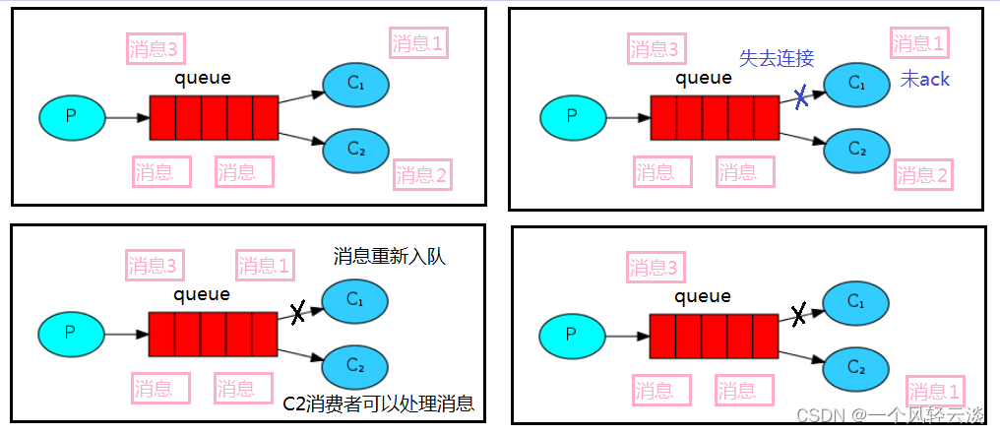

### RabbitMQ持久化

##### 概念

将队列和消息设置为持久化，保存到磁盘上，这样RabbitMQ服务停止之后，生产者发过来的消息不会丢失。

##### 队列持久化

声明队列的时候需要将队列设置为持久化

```java
// 队列持久化，设置 durable=true
channel.queueDeclare(WORK_QUEUE, true, false, false, null);
```

##### 消息持久化

发布消息的时候要设置消息持久化

```java
// 消息持久化，设置额外参数为 MessageProperties.PERSISTENT_TEXT_PLAIN
channel.basicPublish("", WORK_QUEUE, MessageProperties.PERSISTENT_TEXT_PLAIN, msg.getBytes());
```

##### 不公平分发

###### 概念

rabbitMq默认是公平分发的，即轮询分发，有多少个消费者，多少个消费者平均消费消费。但是在工作中，我们希望消费速度快的机器就消费更多的消息。这时候我们可以在消费者设置**channel.basicQos(1)**；不公平分发，来让消费速度快的消费者消费更多的消息。意思就是如果这个任务我还没有处理完或者我还没有应答你，你先别分配给我，我目前只能处理一个任务，然后 rabbitmq 就会把该任务分配给没有那么忙的那个空闲消费者。

```
 // prefetchCount为1表示不公平分发,0表示公平分发,大于1表示预取值
channel.basicQos(prefetchCount);
```

###### 缺点

如果所有的消费者都没有完成手上任务，队列还在不停的添加新任务，队列有可能就会遇到队列被撑满的情况，这个时候就只能添加新的 worker 或者改变其他存储任务的策略。

##### 预取值

### 发布确认(防止发送时消息丢失)

[RabbitMQ学习记录(五)-发布确认机制](https://blog.csdn.net/cuierdan/article/details/124013373)

发布确认机制也就是发送方确认模式，生产者在Channel(信道)上调用confirmSelect()方法，请求将Broker的Channel(信道)设置成为confirm模式，一旦信道进入confirm模式，所有在该信道上流通的消息都会被指派一个唯一的ID(从1开始)，并将消息被推送到匹配的队列中。生产者可以在推送消息之后，通过信道调用waitForConfirms()方法，向RabbitMQ发送消息发布确认请求，RabbitMQ服务器会返回消息发布确认的状态给生产者（包括确认的消息及消息的ID信息），这样生产者就知道消息已经被正确推送到目的队列了。如果收到发布确认失败的消息，生产者可以进行后续的重新发送。

```java
// 创建信道
Channel channel = connection.createChannel();
// 开启confirm模式
channel.confirmSelect();
```

#### 单个确认

单个确认是一种简单的确认方式，它是一种同步确认发布的方式，也就是发布一个消息之后，便向Broker发送确认发布请求，只有当这个消息被确认发布之后，才会继续发布后面的消息，一种串行的确认发布过程，这种方式的发布速度特别的慢，因为前面的消息没有被确认发布，就会阻塞后面所有的消息发布。这种方式的吞吐量每秒小于100条。

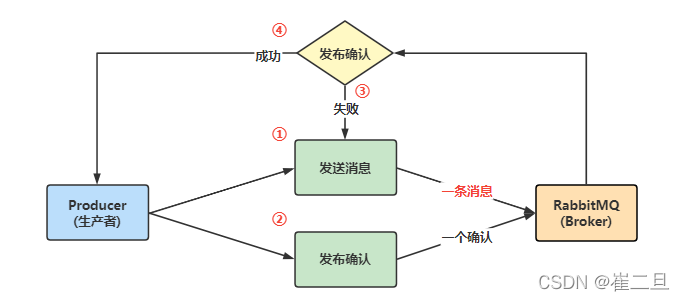

1. 生产者发送一条消息给Broker。
2. 生产者向Broker发送一次发布确认请求 。
3. Broker向生产者返回确认发布失败(NACK)的状态，生产者重新发送这一条消息。失败可能是Broker服务端出现问题，导致消息无法被发送。
4. Broker向生产者返回确认发布成功(ACK)的状态，生产者继续发送下一条消息。

#### 批量确认

批量确认其实是单个确认的一个升级版，因为单个确认的方式是需要一条消息一条消息的确认，发送消息的速度比较慢，如果推送一批消息之后一起确认，这样就会大大提高吞吐量，但是在推送消息的过程中，出现了故障就会导致一些消息丢失，因为在批量确认的时候是一次性确认一批消息，Broker是没有办法返回具体确认状态里消息的信息的，所以出现失败时是不知道丢失的消息是哪个，所以我们要把整批消息记录下来，一边失败后的重新推送。这种批量确认的方式也是同步发送的，也会出现消息阻塞的情况。

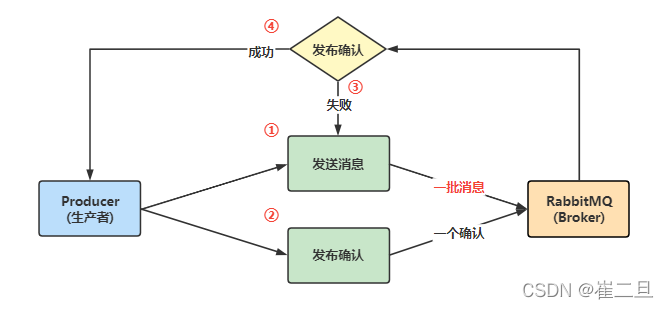

1. 生产者发送一批消息给Broker。
2. 生产者向Broker发送一次发布确认请求 。
3. Broker向生产者返回确认发布失败(NACK)的状态，生产者重新发送这一批消息，失败可能是Broker服务端出现问题，导致消息无法被发送。
4. Broker向生产者返回确认发布成功(ACK)的状态，生产者继续发送下一批消息。

#### 异步确认

Confirm模式最大的好处是可以异步确认，在生产者发送消息之前，在生产者程序中设置一个确认发布监听器，用于给Borker端调用，Broker将确认发布信息推送给生产者确认发布监听器，设置好监听器之后生产者就可以向Broker端推送消息了。确认发布监听器与消息推送是两个独立的线程，所以推送消息和监听状态是可以并行的，也就是所谓的异步操作，生产者可以一直给Broker端推送消息，Broker端会将确认状态通过监听器回调给生产者，Broker端会给确认发布监听器传递两种确认发布的状态，确认成功(Confirm Ack)和确认失败(Confirm Nack)，生产者可以获取到成功或失败的消息，做其它处理，如将失败的消息重新发送。所以异步确认是性价比最好的。

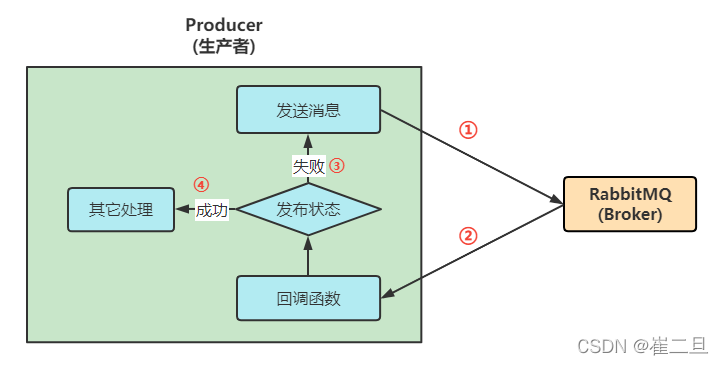

生产者在将Channel(信道)设置成Confirm模式之后，需要先将确认发布监听器准备好，以便于Broker随时可以将消息的确认状态回调给生产者。

1. 生产者连续给Broker发送消息。
2. Broker在接收到消息之后，随时将确认发布状态回传给生产者的监听器（调用回调函数） 。
3. 确认发布监听器将发送失败(Nack)的消息，进行处理重新发送。
4. 确认发布监听器将发送成功(Ack)的消息，进行后续处理，比如进度日志等。

::: details 示例代码
::: tabs
@tab 单个确认

```java
public class ConfirmSingle {
    public static final String QUEUE_NAME="confirm-single";
    public static void main(String[] args) throws Exception {
        Channel channel = RabbitConnectionUtil.getChannel();
        //开启发布确认的方法
        channel.confirmSelect();
        /**
         * 1.队列名称
         * 2.是否持久化,true持久化
         * 3.是否共享
         * 4.是否自动删除
         * 5.其它参数
         */
        boolean durable =true;
        channel.queueDeclare(QUEUE_NAME,durable,false,false,null);
        System.out.println("正在准备发送消息。。。");
        Scanner scanner=new Scanner(System.in);
        while (scanner.hasNext()){
            String message=scanner.next();
            /**
             * 1.发送到那个交换机
             * 2.队列名称
             * 3.其他参数 消息持久化参数:MessageProperties.PERSISTENT_TEXT_PLAIN
             * 4.要发送的消息体
             */
            channel.basicPublish("",QUEUE_NAME, MessageProperties.PERSISTENT_TEXT_PLAIN,message.getBytes(StandardCharsets.UTF_8));
            //服务端返回false或者超时，可以设置消息重发
            boolean b = channel.waitForConfirms();
            if(b) {
                System.out.println("发送消息【" + message + "】完毕");
            }
        }
    }
}
```

@tab 批量确认

```java
public class ConfirmBatch {
    public static void main(String[] args) throws Exception {
        Channel channel = RabbitConnectionUtil.getChannel();
        String queueName= UUID.randomUUID().toString();
        /**
         * 1.队列名称
         * 2.是否持久化,true持久化
         * 3.是否共享
         * 4.是否自动删除
         * 5.其它参数
         */
        channel.queueDeclare(queueName,false,false,false,null);
        //开启发布确认
        channel.confirmSelect();
        //批量确认消息的大小
        int batchSize=100;
        //未确认消息个数
        int noaskCount=1000;
        for(int i=1;i<=1000;i++){
            String message=i+"";
            channel.basicPublish("",queueName,null,message.getBytes());
            //未确认消息个数减1
            noaskCount--;
            //每100个消息，确认一次
            if(i%batchSize==0){
                channel.waitForConfirms();
            }
            System.out.println("发布消息【"+message+"】");
        }
    }
}
```

@tab 异步确认

```java
public class ConfirmAsync {

    public static void main(String[] args) throws Exception {
        Channel channel = RabbitConnectionUtil.getChannel();
        String queueName = UUID.randomUUID().toString();
        /**
         * 1.队列名称
         * 2.是否持久化,true持久化
         * 3.是否共享
         * 4.是否自动删除
         * 5.其它参数
         */
        channel.queueDeclare(queueName, false, false, false, null);
        //开启发布确认
        channel.confirmSelect();
        //线程安全有序的一个哈希表，适用于高并发的情况
        ConcurrentSkipListMap<Long, String> concurrentSkipListMap = new ConcurrentSkipListMap<>();
        /**
         *  确认收到消息的回调
         *  1.消息序列号
         *  2.true可以确认小于或等于该序列号的消息
         *    false只确认当前序列号的消息
         */
        ConfirmCallback askCallback = (sequenceNumber, multiple) -> {
            if (multiple) {
                //返回的是小于或等于该序列号的消息
                ConcurrentNavigableMap<Long, String> longStringConcurrentNavigableMap = concurrentSkipListMap.headMap(sequenceNumber, true);
                Set<Long> longs = longStringConcurrentNavigableMap.keySet();
                for (Long key : longs) {
                    System.out.println("发布的消息【" + longStringConcurrentNavigableMap.get(key) + "】被A确认，序列号" + key);
                }
                //清除该部分未确认消息
                longStringConcurrentNavigableMap.clear();
            } else {
                String message = concurrentSkipListMap.get(sequenceNumber);
                System.out.println("发布的消息【" + message + "】被B确认，序列号" + sequenceNumber);
                //只清除当前序列号的消息
                concurrentSkipListMap.remove(sequenceNumber);
            }
        };
        //未确认消息的回调
        ConfirmCallback nackCallback = (sequenceNumber, multiple) -> {
            String message = concurrentSkipListMap.get(sequenceNumber);
            System.out.println("发布的消息" + message + "未被确认，序列号" + sequenceNumber);
        };

        /**
         *
         添加一个异步确认的监听器
         * 1.确认收到消息的回调
         * 2.未收到消息的回调
         */
        channel.addConfirmListener(askCallback, nackCallback);
        for (int i = 0; i < 1000; i++) {
            String message = "消息" + i;
            /**
             * channel.getNextPublishSeqNo()获取下一个消息的序列号
             * 通过序列号与消息体进行一个关联
             * 全部都是未确认的消息体
             */
            concurrentSkipListMap.put(channel.getNextPublishSeqNo(), message);
            channel.basicPublish("", queueName, null, message.getBytes());
            System.out.println("确认的消息是【" + message + "】");
        }
    }
}
```

@tab 速度对比

```
单个确认：发布1000个消息到同一队列,耗时1863ms。
批量确认：发布1000个批量消息到同一队列,耗时150ms。
异步确认：发布1000个异步消息到同一队列,耗时99ms
```

:::

## 交换机 - 发布/订阅模式

#### 交换机

##### 概念

在RabbitMQ中，生产者发送信息不会直接将消息投递到队列中，而是将消息投递到交换机中，再由交换机转发到具体的队列中，队列再将消息以推送或者拉取方式给消费进行消费。

##### 类型

- 直接(direct) - 对应routing路由模式
- 主题(topic) - 对应topic 主题模式
- 标题(headers)
- 扇出(fanout) - 对应 publish/subscribe订阅模式
- 默认(default): 是一个空串的交换机

#### 临时队列

##### 概念

临时队列是没有持久化的队列。也可以直接随机给队列起一个名字，当消费者断开连接时，队列也会自动删除。

##### 创建方式

```java
String queueName = channel.queueDeclare().getQueue();
```

#### 绑定(bindings)

绑定就是交换机和队列之间的绑定关系。

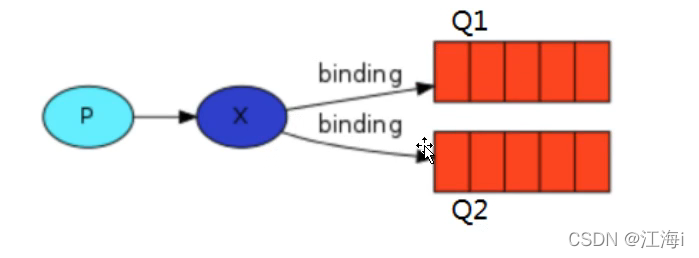

#### Fanout - publish/subscribe订阅模式

它将接收到的所有消息广播到它知道的所有队列中。

::: details 示例代码
::: tabs

@tab 生产者

```java
public class ProducerFanout {
    private static final String EXCHANGE_NAME = "fanout_mq";
    public static void main(String[] args) throws Exception {
        Channel channel = RabbitConnectionUtil.getChannel();
        // 声明交换机
        channel.exchangeDeclare(EXCHANGE_NAME,"fanout");
        Scanner scanner = new Scanner(System.in);
        while (scanner.hasNext()){
            String msg = scanner.next();
              channel.basicPublish(EXCHANGE_NAME,"",null,msg.getBytes(StandardCharsets.UTF_8));
            System.out.println("发送消息：" + msg);
        }
    }
}
```

@tab 消费者1

```java
public class Consumer01 {
    private static final String EXCHANGE_NAME = "fanout_mq";
    public static void main(String[] args) throws Exception {
        Channel channel = RabbitConnectionUtil.getChannel();
        // 声明交换机
        channel.exchangeDeclare(EXCHANGE_NAME,"fanout");
        // 声明临时队列
        String queueName = channel.queueDeclare().getQueue();
        // 绑定交换机和队列
        channel.queueBind(queueName,EXCHANGE_NAME,"");
        System.out.println("Consumer01等待接收消息...");
        DeliverCallback callback = (consumerTag, message) -> {
            System.out.println("Consumer01接收到：" + new String(message.getBody(), StandardCharsets.UTF_8));
        };
        channel.basicConsume(queueName,true,callback,consumerTag -> {});
    }
}
```

@tab 消费者2

```java
public class Consumer02 {
    private static final String EXCHANGE_NAME = "fanout_mq";
    public static void main(String[] args) throws Exception {
        Channel channel = RabbitConnectionUtil.getChannel();
        // 声明交换机
        channel.exchangeDeclare(EXCHANGE_NAME,"fanout");
        // 声明临时队列
        String queueName = channel.queueDeclare().getQueue();
        // 绑定交换机和队列
        channel.queueBind(queueName,EXCHANGE_NAME,"");
        System.out.println("Consumer02等待接收消息...");

        DeliverCallback callback = (consumerTag, message) -> {
            System.out.println("Consumer02接收到：" + new String(message.getBody(), StandardCharsets.UTF_8));
        };
        channel.basicConsume(queueName,true,callback,consumerTag -> {});
    }
}
```

@tab 结果

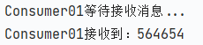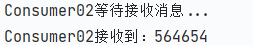

:::

#### Direct - routing路由模式

 指定RoutingKey使得不同的key接收队列的消息。

::: details 示例代码
::: tabs

@tab 生产者

```java
public class ProducerDirect {
    private static final String EXCHANGE_NAME = "direct_mq";
    public static void main(String[] args) throws Exception {
        Channel channel = RabbitConnectionUtil.getChannel();
        // 声明交换机
        channel.exchangeDeclare(EXCHANGE_NAME, BuiltinExchangeType.DIRECT);
        Scanner scanner = new Scanner(System.in);
        int i = 1;
        while (scanner.hasNext()) {
            i++;
            String msg = scanner.next();
            if (i % 2 == 0) {
                channel.basicPublish(EXCHANGE_NAME, "info", null, msg.getBytes(StandardCharsets.UTF_8));
            } else {
                channel.basicPublish(EXCHANGE_NAME, "error", null, msg.getBytes(StandardCharsets.UTF_8));
            }
            System.out.println("发送消息：" + msg);
        }
    }
}
```

@tab 消费者1

```java
public class ConsumerInfo {
    private static final String EXCHANGE_NAME = "direct_mq";
    public static void main(String[] args) throws Exception {
        Channel channel = RabbitConnectionUtil.getChannel();
        // 声明交换机
        channel.exchangeDeclare(EXCHANGE_NAME, BuiltinExchangeType.DIRECT);
        // 声明一个队列
        channel.queueDeclare("console",false,false,false,null);
        // 绑定交换机和队列
        channel.queueBind("console",EXCHANGE_NAME,"info");
        System.out.println("ConsumerInfo等待接收消息...");
        DeliverCallback callback = (consumerTag, message) -> {
            System.out.println("ConsumerInfo接收到：" + new String(message.getBody(), StandardCharsets.UTF_8));
        };
        channel.basicConsume("console",true,callback,consumerTag -> {});
    }
}
```

@tab 消费者2

```java
public class ConsumerError {
    private static final String EXCHANGE_NAME = "direct_mq";
    public static void main(String[] args) throws Exception {
        Channel channel = RabbitConnectionUtil.getChannel();
        // 声明交换机
        channel.exchangeDeclare(EXCHANGE_NAME, BuiltinExchangeType.DIRECT);
        // 声明一个队列
        channel.queueDeclare("console",false,false,false,null);
        // 绑定交换机和队列
        channel.queueBind("console",EXCHANGE_NAME,"error");
        System.out.println("ConsumerError等待接收消息...");
        DeliverCallback callback = (consumerTag, message) -> {
            System.out.println("ConsumerError接收到：" + new String(message.getBody(), StandardCharsets.UTF_8));
        };
        channel.basicConsume("console",true,callback,consumerTag -> {});
    }
}

```

@tab 执行结果

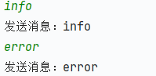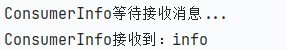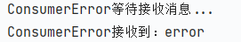

:::

#### Topic - topic 主题模式

上方路由模式中无法同时发送多个队列，在当前topic模式中可以指定多个RoutingKey中间使用英文句号隔开。通配符*代替一个单词；#代表零个或多个单词。

::: details 示例代码
::: tabs

@tab 生产者

```java
public class ProducerTopic {
    private static final String EXCHANGE_NAME = "topic_logs";

    public static void main(String[] args) throws Exception {
        Channel channel = RabbitConnectionUtil.getChannel();
        channel.exchangeDeclare(EXCHANGE_NAME, BuiltinExchangeType.TOPIC);
        /**
         * Q1-->绑定的是
         *      中间带 orange 带 3 个单词的字符串(*.orange.*)
         * Q2-->绑定的是
         *      最后一个单词是 rabbit 的 3 个单词(*.*.rabbit)
         *      第一个单词是 lazy 的多个单词(lazy.#)
         *
         */
        Map<String, String> bindingKeyMap = new HashMap<>();
        bindingKeyMap.put("quick.orange.rabbit", "被队列 Q1Q2 接收到");
        bindingKeyMap.put("lazy.orange.elephant", "被队列 Q1Q2 接收到");
        bindingKeyMap.put("quick.orange.fox", "被队列 Q1 接收到");
        bindingKeyMap.put("lazy.brown.fox", "被队列 Q2 接收到");
        bindingKeyMap.put("lazy.pink.rabbit", "虽然满足两个绑定但只被队列 Q2 接收一次");
        bindingKeyMap.put("quick.brown.fox", "不匹配任何绑定不会被任何队列接收到会被丢弃");
        bindingKeyMap.put("quick.orange.male.rabbit", "是四个单词不匹配任何绑定会被丢弃");
        bindingKeyMap.put("lazy.orange.male.rabbit", "是四个单词但匹配 Q2");
        for (Map.Entry<String, String> bindingKeyEntry : bindingKeyMap.entrySet()) {
            String bindingKey = bindingKeyEntry.getKey();
            String message = bindingKeyEntry.getValue();
            channel.basicPublish(EXCHANGE_NAME, bindingKey, null, message.getBytes("UTF-8"));
            System.out.println("生产者发出消息：" + message);
        }
    }
}
```

@tab 消费者1

```java
public class Consumer01 {

    private static final String EXCHANGE_NAME = "topic_logs";

    public static void main(String[] args) throws Exception {
        Channel channel = RabbitConnectionUtil.getChannel();
        channel.exchangeDeclare(EXCHANGE_NAME, BuiltinExchangeType.TOPIC);
        //声明 Q1 队列与绑定关系
        String queueName = "Q1";
        //声明
        channel.queueDeclare(queueName, false, false, false, null);
        //绑定
        channel.queueBind(queueName, EXCHANGE_NAME, "*.orange.*");
        System.out.println("等待接收消息........... ");
        DeliverCallback deliverCallback = (consumerTag, delivery) -> {
            String message = new String(delivery.getBody(), "UTF-8");
            System.out.println(" 接收队列:" + queueName + " 绑定键:" + delivery.getEnvelope().getRoutingKey() + ",消息:" + message);
        };
        channel.basicConsume(queueName, true, deliverCallback, consumerTag -> {
        });
    }

}

```

@tab 消费者2

```java
public class Consumer02 {
    private static final String EXCHANGE_NAME = "topic_logs";

    public static void main(String[] args) throws Exception {
        Channel channel = RabbitConnectionUtil.getChannel();
        channel.exchangeDeclare(EXCHANGE_NAME, BuiltinExchangeType.TOPIC);
        //声明 Q2 队列与绑定关系
        String queueName = "Q2";
        //声明
        channel.queueDeclare(queueName, false, false, false, null);
        //绑定
        channel.queueBind(queueName, EXCHANGE_NAME, "*.*.rabbit");
        channel.queueBind(queueName, EXCHANGE_NAME, "lazy.#");

        System.out.println("等待接收消息........... ");

        DeliverCallback deliverCallback = (consumerTag, delivery) -> {
            String message = new String(delivery.getBody(), "UTF-8");
            System.out.println(" 接收队列:" + queueName + " 绑定键:" + delivery.getEnvelope().getRoutingKey() + ",消息:" + message);
        };
        channel.basicConsume(queueName, true, deliverCallback, consumerTag -> {
        });
    }
}
```

@tab 执行结果

>生产者发出消息：是四个单词不匹配任何绑定会被丢弃
>生产者发出消息：不匹配任何绑定不会被任何队列接收到会被丢弃
>生产者发出消息：被队列 Q1Q2 接收到
>生产者发出消息：被队列 Q2 接收到
>生产者发出消息：被队列 Q1Q2 接收到
>生产者发出消息：被队列 Q1 接收到
>生产者发出消息：虽然满足两个绑定但只被队列 Q2 接收一次
>生产者发出消息：是四个单词但匹配 Q2

>等待接收消息........... 
> 接收队列:Q1 绑定键:lazy.orange.elephant,消息:被队列 Q1Q2 接收到
> 接收队列:Q1 绑定键:quick.orange.rabbit,消息:被队列 Q1Q2 接收到
> 接收队列:Q1 绑定键:quick.orange.fox,消息:被队列 Q1 接收到

> 等待接收消息........... 
>  接收队列:Q2 绑定键:lazy.orange.elephant,消息:被队列 Q1Q2 接收到
>  接收队列:Q2 绑定键:lazy.brown.fox,消息:被队列 Q2 接收到
>  接收队列:Q2 绑定键:quick.orange.rabbit,消息:被队列 Q1Q2 接收到
>  接收队列:Q2 绑定键:lazy.pink.rabbit,消息:虽然满足两个绑定但只被队列 Q2 接收一次
>  接收队列:Q2 绑定键:lazy.orange.male.rabbit,消息:是四个单词但匹配 Q2

:::

## 死信队列

### 概念

死信，顾名思义就是无法被消费的消息。一般来说，Producer 将消息投递到 Broker 或者直接到 Queue 里了，Consumer 从 Queue 取出消息进行消费，但某些时候由于特定的原因导致 Queue 中的某些消息无法被消费，这样的消息如果没有后续的处理，就变成了死信，有死信自然就有了死信队列。

应用场景：为了保证订单业务的消息数据不丢失，需要使用到 RabbitMQ 的死信队列机制，档消息消费发生异常时，将消息投入到死信队列中。还有比如说：用户在商城下单成功并点击支付后再指定时间未支付时自动失效。

### 来源

- 消息 TTL 过期
- 队列达到最大长度（队列满了，无法再添加数据到 mq 中）
- 消息被拒绝（basic.reject 或 basic.nack）并且 requeue=false（不再重新入队）

### 死信实战

####  代码架构图

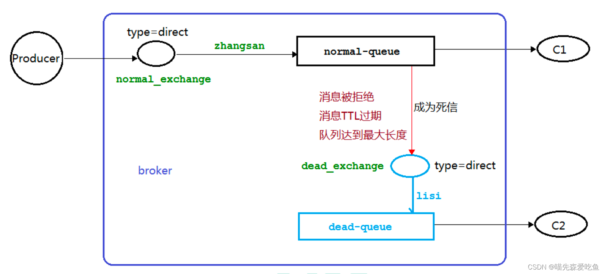

#### 消息 TTL 过期

::: details 示例代码
::: tabs

@tab 生产者

```java
public class DeadLetterProducer {
    private static String EXCHANGE_NAME = "normal_exchange";
    private static String DEAD_EXCHANGE_NAME = "dead_exchange";
    private static String DEAD_QUEUE_NAME = "dead-queue";
    private static String NORMAL_QUEUE_NAME = "normal-queue";

    public static void main(String[] args) throws IOException, TimeoutException, TimeoutException {
        Channel channel = RabbitConnectionUtil.getChannel();

          // 声明一个死信交换机
        channel.exchangeDeclare(DEAD_EXCHANGE_NAME, BuiltinExchangeType.DIRECT);
        // 声明一个死信队列
        channel.queueDeclare(DEAD_QUEUE_NAME, false, false, false, null);
        // 死信队列与死信交换机绑定
        channel.queueBind(DEAD_QUEUE_NAME, DEAD_EXCHANGE_NAME, "lisi");
        // 声明一个普通交换机
        channel.exchangeDeclare(EXCHANGE_NAME, BuiltinExchangeType.DIRECT);
        // 正常队列与死信交换机的绑定关系
        Map<String, Object> deadLetterParams = new HashMap<>(2);
        deadLetterParams.put("x-dead-letter-exchange", DEAD_EXCHANGE_NAME);
        deadLetterParams.put("x-dead-letter-routing-key","lisi");
        channel.queueDeclare(NORMAL_QUEUE_NAME, false, false, false, deadLetterParams);
        // 把队列和交换机进行绑定
        channel.queueBind(NORMAL_QUEUE_NAME, EXCHANGE_NAME, "zhangsan");

        // 设置消息 TTL 过期时间
        AMQP.BasicProperties properties = new AMQP.BasicProperties().builder().expiration("1000").build();
        String message = "info";
        channel.basicPublish(EXCHANGE_NAME, "zhangsan", properties, message.getBytes());
        System.out.println("消息发送完成：" + message);
    }
}
```

@tab 正常消费者

```java
public class DeadLetterConsumer1 {
    private static String NORMAL_QUEUE_NAME = "normal-queue";
    public static void main(String[] args) throws Exception, TimeoutException, TimeoutException {
        Channel channel = RabbitConnectionUtil.getChannel();
        System.out.println("正常消费者启动等待消费消息：");

        channel.basicConsume(NORMAL_QUEUE_NAME, true, (consumerTag, delivery) -> {
            try {
                Thread.sleep(100000);
            } catch (InterruptedException e) {
                throw new RuntimeException(e);
            }
            String receivedMessage = new String(delivery.getBody());
            System.out.println("正常消费者接收到消息：" + receivedMessage);
        },(consumerTag) -> {
            System.out.println(consumerTag + "正常消费者取消消费消息");
        });
    }
}
```

@tab 死信消费者

```java
public class DeadLetterConsumer2 {
    private static String DEAD_QUEUE_NAME = "dead-queue";
    public static void main(String[] args) throws IOException, TimeoutException, TimeoutException {
        Channel channel = RabbitConnectionUtil.getChannel();
        System.out.println("死信队列消费者启动等待消费消息：");
        channel.basicConsume(DEAD_QUEUE_NAME, true, (consumerTag, delivery) -> {
            String receivedMessage = new String(delivery.getBody());
            System.out.println("死信队列消费者接收到死信：" + receivedMessage);
        },(consumerTag) -> {
            System.out.println(consumerTag + "死信队列消费者取消消费消息");
        });
    }
}
```

@tab 执行结果

>消息发送完成：info

>正常消费者启动等待消费消息：
>正常消费者接收到消息：info

当正常消费者挂掉后

>死信队列消费者启动等待消费消息：
>  死信队列消费者接收到死信：info

:::

#### 队列达到最大长度

::: details 示例代码
::: tabs

@tab 生产者

```java
public class DeadLetterLengthProducer {
    private static String EXCHANGE_NAME = "normal_exchange";
    private static String DEAD_EXCHANGE_NAME = "dead_exchange";
    private static String DEAD_QUEUE_NAME = "dead-queue";
    private static String NORMAL_QUEUE_NAME = "normal-queue";

    public static void main(String[] args) throws IOException, TimeoutException, TimeoutException {
        Channel channel = RabbitConnectionUtil.getChannel();
        // 声明一个死信交换机
        channel.exchangeDeclare(DEAD_EXCHANGE_NAME, BuiltinExchangeType.DIRECT);
        // 声明一个死信队列
        channel.queueDeclare(DEAD_QUEUE_NAME, false, false, false, null);
        // 死信队列与死信交换机绑定
        channel.queueBind(DEAD_QUEUE_NAME, DEAD_EXCHANGE_NAME, "lisi");
        // 声明一个普通交换机
        channel.exchangeDeclare(EXCHANGE_NAME, BuiltinExchangeType.DIRECT);
        // 正常队列与死信交换机的绑定关系
        Map<String, Object> deadLetterParams = new HashMap<>(3);
        deadLetterParams.put("x-dead-letter-exchange", DEAD_EXCHANGE_NAME);
        deadLetterParams.put("x-dead-letter-routing-key","lisi");
        deadLetterParams.put("x-max-length", 6);
        channel.queueDeclare(NORMAL_QUEUE_NAME, false, false, false, deadLetterParams);
        // 把队列和交换机进行绑定
        channel.queueBind(NORMAL_QUEUE_NAME, EXCHANGE_NAME, "zhangsan");

        for (int i = 0; i < 10; i++) {
            String message = "info" + i;
            channel.basicPublish(EXCHANGE_NAME, "zhangsan", null, message.getBytes());
        }
        System.out.println("消息发送完成");

    }
}

```

@tab 正常消费者

```java
public class DeadLetterLengthConsumer1 {
    private static String NORMAL_QUEUE_NAME = "normal-queue";
    public static void main(String[] args) throws Exception, TimeoutException, TimeoutException {
        Channel channel = RabbitConnectionUtil.getChannel();
        System.out.println("正常消费者启动等待消费消息：");

        channel.basicConsume(NORMAL_QUEUE_NAME, true, (consumerTag, delivery) -> {

            String receivedMessage = new String(delivery.getBody());
            System.out.println("正常消费者接收到消息：" + receivedMessage);
        },(consumerTag) -> {
            System.out.println(consumerTag + "正常消费者取消消费消息");
        });
    }
}

```

@tab 死信消费者

```java
public class DeadLetterLengthConsumer2 {
    private static String DEAD_QUEUE_NAME = "dead-queue";
    public static void main(String[] args) throws IOException, TimeoutException, TimeoutException {
        Channel channel = RabbitConnectionUtil.getChannel();
        System.out.println("死信队列消费者启动等待消费消息：");
        channel.basicConsume(DEAD_QUEUE_NAME, true, (consumerTag, delivery) -> {
            String receivedMessage = new String(delivery.getBody());
            System.out.println("死信队列消费者接收到死信：" + receivedMessage);
        },(consumerTag) -> {
            System.out.println(consumerTag + "死信队列消费者取消消费消息");
        });
    }
}
```

@tab 执行结果

>消息发送完成

>

当超过队列长度后

>死信队列消费者启动等待消费消息：
>死信队列消费者接收到死信：info0
>死信队列消费者接收到死信：info1
>死信队列消费者接收到死信：info2
>死信队列消费者接收到死信：info3

:::

#### 消息被拒

::: details 示例代码
::: tabs

@tab 生产者

```java
public class DeadLetterRejectProducer {
    private static String EXCHANGE_NAME = "normal_exchange";
    private static String DEAD_EXCHANGE_NAME = "dead_exchange";
    private static String DEAD_QUEUE_NAME = "dead-queue";
    private static String NORMAL_QUEUE_NAME = "normal-queue";

    public static void main(String[] args) throws IOException, TimeoutException, TimeoutException {
        Channel channel = RabbitConnectionUtil.getChannel();
        // 声明一个死信交换机
        channel.exchangeDeclare(DEAD_EXCHANGE_NAME, BuiltinExchangeType.DIRECT);
        // 声明一个死信队列
        channel.queueDeclare(DEAD_QUEUE_NAME, false, false, false, null);
        // 死信队列与死信交换机绑定
        channel.queueBind(DEAD_QUEUE_NAME, DEAD_EXCHANGE_NAME, "lisi");
        // 声明一个普通交换机
        channel.exchangeDeclare(EXCHANGE_NAME, BuiltinExchangeType.DIRECT);
        // 正常队列与死信交换机的绑定关系
        Map<String, Object> deadLetterParams = new HashMap<>(3);
        deadLetterParams.put("x-dead-letter-exchange", DEAD_EXCHANGE_NAME);
        deadLetterParams.put("x-dead-letter-routing-key","lisi");
        channel.queueDeclare(NORMAL_QUEUE_NAME, false, false, false, deadLetterParams);
        // 把队列和交换机进行绑定
        channel.queueBind(NORMAL_QUEUE_NAME, EXCHANGE_NAME, "zhangsan");

        for (int i = 0; i < 10; i++) {
            String message = "info" + i;
            channel.basicPublish(EXCHANGE_NAME, "zhangsan", null, message.getBytes());
        }
        System.out.println("消息发送完成");

    }
}
```

@tab 正常消费者

```java
public class DeadLetterRejectConsumer1 {
    private static String NORMAL_QUEUE_NAME = "normal-queue";
    public static void main(String[] args) throws Exception, TimeoutException, TimeoutException {
        Channel channel = RabbitConnectionUtil.getChannel();
        System.out.println("正常消费者启动等待消费消息：");

        channel.basicConsume(NORMAL_QUEUE_NAME, false, (consumerTag, delivery) -> {
            String receivedMessage = new String(delivery.getBody());
            if ("info5".equals(receivedMessage)) {
                System.out.println("C1接收到消息：" + receivedMessage+"并且拒绝签收了");
                // 禁止重新入队
                channel.basicReject(delivery.getEnvelope().getDeliveryTag(), false);
            } else {
                System.out.println("消费者接收到消息：" + receivedMessage);
                channel.basicAck(delivery.getEnvelope().getDeliveryTag(), false);
            }
        },(consumerTag) -> {
            System.out.println(consumerTag + "正常消费者取消消费消息");
        });
    }
}

```

@tab 死信消费者

```java
public class DeadLetterLengthConsumer2 {
    private static String DEAD_QUEUE_NAME = "dead-queue";
    public static void main(String[] args) throws IOException, TimeoutException, TimeoutException {
        Channel channel = RabbitConnectionUtil.getChannel();
        System.out.println("死信队列消费者启动等待消费消息：");
        channel.basicConsume(DEAD_QUEUE_NAME, true, (consumerTag, delivery) -> {
            String receivedMessage = new String(delivery.getBody());
            System.out.println("死信队列消费者接收到死信：" + receivedMessage);
        },(consumerTag) -> {
            System.out.println(consumerTag + "死信队列消费者取消消费消息");
        });
    }
}
```

@tab 执行结果

>消息发送完成

>正常消费者启动等待消费消息：
>消费者接收到消息：info0
>消费者接收到消息：info1
>消费者接收到消息：info2
>消费者接收到消息：info3
>消费者接收到消息：info4
>C1接收到消息：info5并且拒绝签收了
>消费者接收到消息：info6
>消费者接收到消息：info7
>消费者接收到消息：info8
>消费者接收到消息：info9

当第5条被拒绝后

>死信队列消费者启动等待消费消息：
>死信队列消费者接收到死信：info5

:::

## 延迟队列

### 概念

延迟队列存储的对象是对应的延迟消息，所谓“延迟消息”是指当消息被发送以后，并不想让消费者立刻拿到消息，而是等待特定时间后，消费者才能拿到这个消息进行消费。

### 延迟队列使用场景

1. 订单在十分钟之内未支付则自动取消
2. 新创建的店铺，如果在十天内都没有上传过商品，则自动发送消息提醒。
3. 用户注册成功后，如果三天内没有登录则进行短信提醒。
4. 用户发起退款后，如果三天内没有得到处理则通知相关运营人员。
5. 预定会议后，需要在预定时间点前十分钟通知各个与会人员参加会议。

这些场景都有一个特点，需要在某个时间发生之后或者之前的指定时间点完成某一项任务，如：发生订单生成事件，在十分钟之后检查该订单支付状态，然后将未支付的订单进行关闭。看起来似乎使用定时任务，一直轮询数据，每秒查一次，然后取出需要被处理的数据进行处理就可以了。如果数据量比较少，确实可以这样做，比如：对于“如果账单一周内未支付则进行自动结算”这样的需求，如果对于时间不是严格限制，而是宽松意义上的一周，那么每天晚上跑个定时任务检查一下所有未支付的账单，确实也是一个可行的方案。但对于数据量比较大，并且时效性较强的场景，如：“订单十分钟内未支付则关闭”，短期内未支付的订单数据可能会很多，活动期间甚至会达到百万甚至千万级别，对这么庞大的数据量仍旧使用轮询的方式显然是不可取的，很可能在一秒内无法完成所有订单的检查，同时会给数据库带来很大压力，无法满足业务要求而且性能低下。


### RabbitMQ 中的 TTL

#### 设置消息 TTL

针对每条消息设置 TTL 的方法时在 channel.basicPublish 方法中加入 expiration 的属性参数，单位为毫秒。

```java
// 设置消息 TTL 过期时间为 10s
AMQP.BasicProperties properties = new AMQP.BasicProperties().builder().expiration("10000").build();
String message = "info";
channel.basicPublish(EXCHANGE_NAME, "zhangsan", properties, message.getBytes());
```

#### 设置队列 TTL

通过 channel.queueDeclare 方法中的 x-expires 参数可以控制队列被自动删除前处于未使用状态的时间。未使用的意思是队列上没有任何的消费者，队列也没有被重新声明，并且在过期时间段内也未调用过 Basic.get 命令。

RabbitMQ 会确保在过期时间到达后将队列删除，但是不保障删除的动作有多及时。在 RabbitMQ 重启后，持久化的队列的过期时间会被重新计算。

用于表示过期时间的 x-expires 参数以毫秒为单位，并且服从和 x-message-ttl 一样的约束条件，不过不能设置为 0。比如该参数设置为 1000，则表示该队列如果在 1 秒钟之内未使用则会被删除。

```java
Map<String,Object> args = new HashMap<>();
args.put("x-expires", 1800000);
channel.queueDeclare("myqueue",false, false, false, args);
```

#### 两者的区别

如果设置了队列的 TTL 属性，那么一旦消息过期，就会被队列丢弃（如果配置了死信队列则会被丢到死信队列中），而第二种方式，消息即使过期，也不一定会被马上丢弃，因为消息是否过期是在即将投递到消费者之前判定的，如果当前队列有严重的消息积压情况，则已过期的消息也许还能存活较长时间；另外，还需要注意一点是，如果不设置 TTL，表示消息永远不会过期，如果将 TTL 设置为 0，则表示除非此时可以直接投递该消息到消费者，否则该消息将会别丢弃。

## SpringBoot 整合 RabbitMQ

#### 添加依赖

```xml
<dependencies>
    <dependency>
        <groupId>org.springframework.boot</groupId>
        <artifactId>spring-boot-starter-amqp</artifactId>
    </dependency>
    <dependency>
        <groupId>org.springframework.boot</groupId>
        <artifactId>spring-boot-starter-web</artifactId>
    </dependency>

    <dependency>
        <groupId>org.projectlombok</groupId>
        <artifactId>lombok</artifactId>
        <optional>true</optional>
    </dependency>
    <dependency>
        <groupId>org.springframework.boot</groupId>
        <artifactId>spring-boot-starter-test</artifactId>
        <scope>test</scope>
    </dependency>
    <dependency>
        <groupId>org.springframework.amqp</groupId>
        <artifactId>spring-rabbit-test</artifactId>
        <scope>test</scope>
    </dependency>
    <dependency>
        <groupId>com.alibaba</groupId>
        <artifactId>fastjson</artifactId>
        <version>1.2.80</version>
    </dependency>
</dependencies>

```

#### 修改配置文件

```yml
spring:
  rabbitmq:
    host: IP地址
    username: admin
    password: admin
    port: 5672

```

#### 队列 TTL

创建两个队列 QA 和 QB，两个队列 TTL 分别设置为 10s 和 40s，然后再创建一个交换机 X 和死信交换机 Y，它们的类型都是 direct，创建一个死信队列 QD，它们的绑定关系如下：

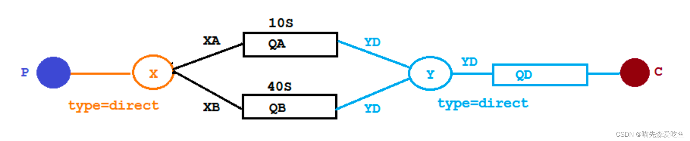

::: details 示例代码
::: tabs

@tab 配置文件类代码

```java
@Configuration
public class TtlQueueConfig {

    /**
     * 普通交换机名称
     */
    public static final String X_EXCHANGE = "X";

    /**
     * 死信交换机名称
     */
    public static final String Y_DEAD_LETTER_EXCHANGE = "Y";
    /**
     * 普通队列名称
     */
    public static final String QUEUE_A = "QA";
    public static final String QUEUE_B = "QB";
    /**
     * 死信队列名称
     */
    public static final String DEAD_LETTER_QUEUE = "QD";

    /**
     * 声明 XExchange
     */
    @Bean
    public DirectExchange xExchange(){
        return new DirectExchange(X_EXCHANGE);
    }

    /**
     * 声明 yExchange
     */
    @Bean
    public DirectExchange yExchange(){
        return new DirectExchange(Y_DEAD_LETTER_EXCHANGE);
    }

    /**
     * 声明队列QA
     */
    @Bean
    public Queue queueA(){
        Map<String, Object> arguments = new HashMap<>(3);
        // 设置死信交换机
        arguments.put("x-dead-letter-exchange", Y_DEAD_LETTER_EXCHANGE);
        // 设置死信路由键
        arguments.put("x-dead-letter-routing-key", "YD");
        // 设置过期时间
        arguments.put("x-message-ttl", 10000);
        return new Queue(QUEUE_A, true, false, false, arguments);
    }

    /**
     * 声明队列QB
     */
    @Bean
    public Queue queueB(){
        Map<String, Object> arguments = new HashMap<>(3);
        // 设置死信交换机
        arguments.put("x-dead-letter-exchange", Y_DEAD_LETTER_EXCHANGE);
        // 设置死信路由键
        arguments.put("x-dead-letter-routing-key", "YD");
        // 设置过期时间
        arguments.put("x-message-ttl", 40000);
        return QueueBuilder.durable(QUEUE_B).withArguments(arguments).build();
    }

    /**
     * 死信队列QD
     */
    @Bean
    public Queue queueD(){
        return QueueBuilder.durable(DEAD_LETTER_QUEUE).build();
    }


    /**
     * 绑定
     */
    @Bean
    public Binding queueABindingX(@Qualifier("queueA") Queue queueA,@Qualifier("xExchange") DirectExchange xExchange){
        return BindingBuilder.bind(queueA).to(xExchange).with("XA");
    }

    @Bean
    public Binding queueBBindingX(){
        return new Binding(QUEUE_B, Binding.DestinationType.QUEUE, X_EXCHANGE, "XB", null);
    }

    @Bean
    public Binding queueDBindingY(@Qualifier("queueD") Queue queueD,@Qualifier("yExchange") DirectExchange yExchange){
        return BindingBuilder.bind(queueD).to(yExchange).with("YD");
    }
}
```

@tab 消息生产者代码

```java
@Slf4j
@RestController
@RequestMapping("/ttl")
public class SendMsgController {

    @Autowired
    private RabbitTemplate rabbitTemplate;

    @GetMapping("/sendMsg/{message}")
    public String sendMsg(@PathVariable String message){
        log.info("当前时间：{}发送一条消息{}给两个队列", new Date(), message);
        rabbitTemplate.convertAndSend("X", "XA", "消息来自TTL为10s队列QA："+message);
        rabbitTemplate.convertAndSend("X", "XB", "消息来自TTL为40s队列QB："+message);
        return "发送成功";
    }
}

```

@tab 消息消费者代码

```java
@Slf4j
@Component
public class DeadLetterConsumer {

    @RabbitListener(queues = "QD")
    public void receiveD(Delivery message){
        String msg = new String(message.getBody());
        log.info("当前时间{}，收到死信队列的消息：{}", new Date(), msg);
    }
}

```

@tab 执行结果

>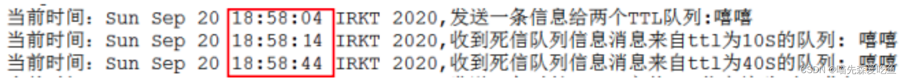

第一条消息在 10s 后变成了死信消息，然后被消费者消费掉了，第二条消息在 40s 之后变成了死信消息，然后被消费掉，这样一个延时队列就完成了。

不过，如果这样使用的话，岂不是每增加一个新的时间需求，就要新增一个队列，这里只有 10s 和 40s 两个时间选项，如果需要一个小时后处理，那么就需要增加 TTL 为一个小时的队列，如果是预定会议室，然后提前通知这样的场景，岂不是要增加无数个队列才能满足需求？

:::

#### 延时队列优化

##### 代码架构图

在这里新增了一个队列 QC，绑定关系如下，该队列不设置 TTL 时间

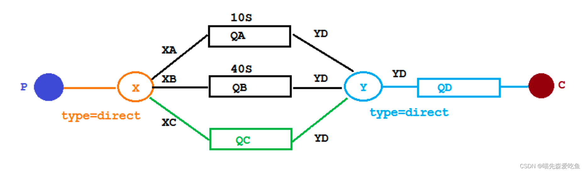

::: details 示例代码
::: tabs

@tab 配置文件类代码

```java
@Component
public class MsgTtlQueueConfig {

    private static final String Y_DEAD_LETTER_EXCHANGE = "Y";
    private static final String QUEUE_C = "QC";

    @Bean("queueC")
    public Queue queueC(){
        Map<String, Object> arguments = new HashMap<>(2);
        // 声明当前队列绑定的死信交换机
        arguments.put("x-dead-letter-exchange", Y_DEAD_LETTER_EXCHANGE);
        // 声明当前队列的私信路由key
        arguments.put("x-dead-letter-routing-key", "YD");
        return new Queue(QUEUE_C, false, false, false, arguments);
    }

    @Bean
    public Binding queueCBindingX(@Qualifier("queueC") Queue queueC,
                                  @Qualifier("xExchange") DirectExchange xExchange){
        return BindingBuilder.bind(queueC).to(xExchange).with("XC");
    }
}
```

@tab 消息生产者代码

```java
@Slf4j
@RestController
@RequestMapping("/ttl")
public class SendMsgController {

    @Autowired
    private RabbitTemplate rabbitTemplate;

    @GetMapping("/sendExpirationMsg/{message}/{ttlTime}")
    public String sendMsg(@PathVariable String message, @PathVariable String ttlTime){
        rabbitTemplate.convertAndSend("X", "XC", message, (messagePostProcessor) -> {
            messagePostProcessor.getMessageProperties().setExpiration(ttlTime);
            return messagePostProcessor;
        });

       /* MessagePostProcessor messagePostProcessor = new MessagePostProcessor() {
            @Override
            public Message postProcessMessage(Message message) throws AmqpException {
                message.getMessageProperties().setExpiration(ttlTime);
                return message;
            }
        };
        rabbitTemplate.convertAndSend("X", "XC", message, messagePostProcessor);
*/        return "发送成功";
    }

}
```

@tab 消息消费者代码

```java
@Slf4j
@Component
public class DeadLetterConsumer {

    @RabbitListener(queues = "Y")
    public void receiveD(Delivery message){
        String msg = new String(message.getBody());
        log.info("当前时间{}，收到死信队列的消息：{}", new Date(), msg);
    }
}

```

@tab 执行结果

>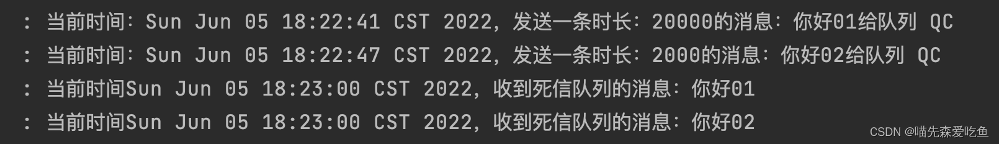

两条消息的过期时间一致，过期时间短的那条消息，在过期时间到了以后并没有立即被消费，而是和过期时间长的那条消息一起被消费了。所以，如果使用在消息属性上设置 TTL 的方式，消息可能并不会按时“死亡”，因为 RabbitMQ 只会检查第一个消息是否过期，如果过期则丢到死信队列，如果第一个消息的延时时长很长，而第二个消息的延时时长很短，第二个消息并不会优先得到执行。

:::

#### Rabbitmq 插件实现延迟队列

##### Docker 安装延时队列插件

[插件下载地址](https://github.com/rabbitmq/rabbitmq-delayed-message-exchange/releases)

```sh
#下载插件
wget -c https://github.com/rabbitmq/rabbitmq-delayed-message-exchange/releases/download/3.9.0/rabbitmq_delayed_message_exchange-3.9.0.ez
# 拷贝插件
docker cp /opt/soft-ware/rabbitmq_delayed_message_exchange-3.9.0.ez  rabbitmq:/opt/rabbitmq/plugins/
# 进入容器内
docker exec -it rabbitmq bash
# 查看插件列表
rabbitmq-plugins list 
# 开启插件支持 
rabbitmq-plugins enable rabbitmq_delayed_message_exchange
```

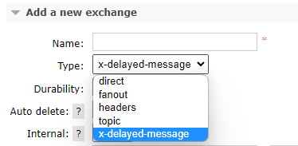

##### 代码架构图

在这里新增了一个队列 delayed.queue，一个自定义交换机 delayed.exchange，绑定关系如下：

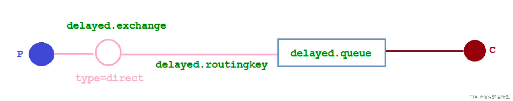

::: details 示例代码
::: tabs

@tab 配置文件类代码

在我们自定义的交换机中，这是一种新的交换机类型，该类型消息支持延迟投递机制，消息传递后并不会立即投递到目标队列中，而是存储在 mnesia（一个分布式数据系统）表中，当达到投递时间时，才投递到目标队列中。

```java
@Configuration
public class DelayedQueueConfig {

    public static final String DELAYED_QUEUE_NAME = "delayed.queue";
    public static final String DELAYED_EXCHANGE_NAME = "delayed.exchange";
    public static final String DELAYED_ROUTING_KEY = "delayed.routingKey";

    @Bean("delayedQueue")
    public Queue delayedQueue(){
        return new Queue(DELAYED_QUEUE_NAME);
    }

    /**
     * 自定义交换机 定义一个延迟交换机
     *  不需要死信交换机和死信队列，支持消息延迟投递，消息投递之后没有到达投递时间，是不会投递给队列
     *  而是存储在一个分布式表，当投递时间到达，才会投递到目标队列
     * @return
     */
    @Bean("delayedExchange")
    public CustomExchange delayedExchange(){
        Map<String, Object> args = new HashMap<>(1);
        // 自定义交换机的类型
        args.put("x-delayed-type", "direct");
        return new CustomExchange(DELAYED_EXCHANGE_NAME, "x-delayed-message", true, false, args);
    }

    @Bean
    public Binding bindingDelayedQueue(@Qualifier("delayedQueue") Queue delayedQueue,
                                       @Qualifier("delayedExchange") CustomExchange delayedExchange){
        return BindingBuilder.bind(delayedQueue).to(delayedExchange).with(DELAYED_ROUTING_KEY).noargs();
    }
}
```

@tab 消息生产者代码

```java
@Slf4j
@RestController
@RequestMapping("/ttl")
public class SendMsgController {

    @Autowired
    private RabbitTemplate rabbitTemplate;

    public static final String DELAYED_EXCHANGE_NAME = "delayed.exchange";
    public static final String DELAYED_ROUTING_KEY = "delayed.routingKey";

    @GetMapping("/sendDelayMsg/{message}/{delayTime}")
    public String sendMsg(@PathVariable String message, @PathVariable Integer delayTime){
        rabbitTemplate.convertAndSend(DELAYED_EXCHANGE_NAME, DELAYED_ROUTING_KEY, message, messagePostProcessor ->{
            messagePostProcessor.getMessageProperties().setDelay(delayTime);
            return messagePostProcessor;
        });
        log.info("当前时间：{}，发送一条延迟{}毫秒的信息给队列delay.queue:{}", new Date(), delayTime, message);
        return "发送成功";
    }
}
```

@tab 消息消费者代码

```java
@Slf4j
@Component
public class DeadLetterConsumer {

    public static final String DELAYED_QUEUE_NAME = "delayed.queue";

    @RabbitListener(queues = DELAYED_QUEUE_NAME)
    public void receiveDelayedQueue(Message message){
        String msg = new String(message.getBody());
        log.info("当前时间：{}，收到延时队列的消息：{}", new Date(), msg);
    }
}
```

@tab 执行结果

>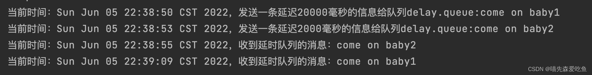

:::

#### 总结

延时队列在需要延时处理的场景下非常有用，使用 RabbitMQ 来实现延时队列可以很好地利用 RabbitMQ 的特性，如：消息可靠发送、消息可靠投递、死信队列，来保证消息至少被消费一次以及未被正确处理的消息不会被丢弃。另外，通过 RabbitMQ 集群的特性，可以很好要的解决单点故障问题，不会因为单个节点挂掉导致延时队列不可用或者消息丢失。

## 发布确认高级

### 存在的问题

再生产环境中由于一些不明原因导致`rabbitmq`重启，在`RabbitMQ`重启期间生产者消息投递失败，会导致消息丢失。

### 发布确认SpringBoot版本

#### 确认机制方案

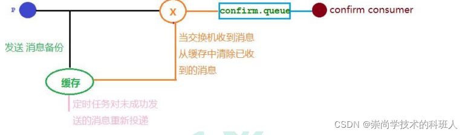

当消息不能正常被接收的时候，我们需要将消息存放在缓存中。

#### 代码架构图

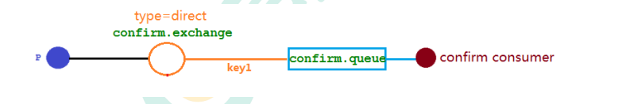

::: details 示例代码
::: tabs

@tab 配置文件

1. none：默认值，禁用发布确认
2. correlated：发布消息到交换机后触发回调方法
3. simple：有两种效果：第一种效果与correlated一样；其二，单个确认，在发布消息成功后使用rabbitTemplate,调用waitForConfirms或 waitForConfirmsOrDie方法等待broker节点返回发送结果，根据返回结果来判定下一步的逻辑，要注意的点是waitForConfirmsOrDie方法如果返回false则会关闭channel，则接下来无法发送消息到broker。

```yml
spring:
  rabbitmq:
    host: IP地址
    username: admin
    password: admin
    port: 5672
    virtual-host: /test
    publisherConfirms: true
    publisherReturns: true
    #publisher-confirm-type: correlated
```

@tab 配置类

```java
@Configuration
public class ConfirmConfig {

    public static final String CONFIRM_EXCHANGE_NAME = "confirm_exchange";

    public static final String CONFIRM_QUEUE_NAME = "confirm_queue";

    public static final String CONFIRM_ROUTING_KEY = "key1";

    @Bean("confirmExchange")
    public DirectExchange confirmExchange() {
        return new DirectExchange(CONFIRM_EXCHANGE_NAME);
    }

    @Bean("confirmQueue")
    public Queue confirmQueue() {
        return QueueBuilder.durable(CONFIRM_QUEUE_NAME).build();
    }

    @Bean
    public Binding queueBindingExchange(@Qualifier("confirmExchange") DirectExchange confirmExchange, @Qualifier("confirmQueue") Queue confirmQueue) {
        return BindingBuilder.bind(confirmQueue).to(confirmExchange).with(CONFIRM_ROUTING_KEY);
    }
}
```

@tab 回调接口

```java

@Component
@Slf4j
public class MyCallBack implements RabbitTemplate.ConfirmCallback {

    @Autowired RabbitTemplate rabbitTemplate;

    @PostConstruct
    public void init() {
        rabbitTemplate.setConfirmCallback(this);
    }

    /**
     * 交换机接受失败后进行回调
     * 1. 保存消息的ID及相关消息
     * 2. 是否接收成功
     * 3. 接受失败的原因
     */

    @Override
    public void confirm(CorrelationData correlationData, boolean ack, String cause) {
        String id = correlationData != null ? correlationData.getId() : "";
        if (ack) {
            log.info("交换机已经收到id为：{}的消息", id);
        } else {
            log.info("交换机还未收到id为：{}消息，由于原因：{}", id, cause);
        }
    }
}
```

@tab 生产者

```java
@RestController
@RequestMapping("/confirm")
@Slf4j
public class Producer {
    public static final String CONFIRM_EXCHANGE_NAME = "confirm_exchange";
    @Autowired RabbitTemplate rabbitTemplate;
    @GetMapping("/sendMessage/{message}")
    public void sendMessage(@PathVariable String message){
        CorrelationData correlationData1 = new CorrelationData("1");
        String routingKey1 = "key1";
        rabbitTemplate.convertAndSend(CONFIRM_EXCHANGE_NAME,routingKey1,message + routingKey1,correlationData1);

        CorrelationData correlationData2 = new CorrelationData("2");
        String routingKey2 = "key2";
        rabbitTemplate.convertAndSend(CONFIRM_EXCHANGE_NAME,routingKey2,message + routingKey2,correlationData2);
        log.info("发送得内容是：{}",message);
    }
}
```

@tab 消费者

```java
@Component
@Slf4j
public class ConfirmConsumer {
    public static final String CONFIRM_QUEUE_NAME = "confirm_queue";

    @RabbitListener(queues = CONFIRM_QUEUE_NAME)
    public void receiveMessage(Message message){
        String msg = new String(message.getBody());
        log.info("接收到队列" + CONFIRM_QUEUE_NAME + "消息：{}",msg);
    }
}
```

:::

#### 回退消息

##### Mandatory参数

Mandatory译为强制性的。**在仅开启生产者确认机制的情况下，交换机接收到消息后，会直接给消息生产者发送确认消息，如果发现该消息不可路由，也就是交换机通过routingKey找不到对应的队列，那么此消息会被直接丢弃，此时，生产者是不知道消息被丢弃的。**如何让无法被路由的消息被处理；通过设置Mandatory参数可以在当消息传递的过程中不可路由时，将消息返回给生产者。

##### 编码实现

实现RabbitTemplate.ReturnCallback接口，并实现其的方法returnedMessage

```java
@Slf4j
@Component
public class MyCallBack implements RabbitTemplate.ConfirmCallback, RabbitTemplate.ReturnCallback {

    @Autowired
    private RabbitTemplate rabbitTemplate;

    @PostConstruct
    public void init() {
        rabbitTemplate.setConfirmCallback(this);
        rabbitTemplate.setReturnCallback(this);
    }

    /**
     * 交换机接收到消息后的回调方法
     *
     * @param correlationData 保存了回调的消息ID及相关信息
     * @param ack             true/false：成功/失败
     * @param cause           失败原因
     */
    @Override
    public void confirm(CorrelationData correlationData, boolean ack, String cause) {
        String id = correlationData != null ? correlationData.getId() : "";
        if (ack) {
            log.info("交换机成功收到了ID为：{}的消息", id);
        } else {
            log.info("交换机未收到了ID为：{}的消息，原因为：{}", id, cause);
        }
    }

    /**
     * 当消息不可路由时，返回给生产者
     *
     * @param message    消息
     * @param replyCode  退回码
     * @param replyText  退回原因
     * @param exchange   交换机
     * @param routingKey routingKey
     */
    @Override
    public void returnedMessage(Message message, int replyCode, String replyText, String exchange, String routingKey) {
        log.error("消息：{}，被交换机：{}退回，退回原因：{}，路由Key:{}", new String(message.getBody()), 
                  exchange, replyText, routingKey);
    }
}

```

### 备份交换机

在上面我们提到如果生产者的消息发送到交换机，在发送的过程中出现了问题，并没有发送到交换机；我们需要进行消息的回退，让消息回退到生产者。这只是一种解决方法，还有一种较好的方法是增加一台备份交换机。让消息不在回退到消费者，而是发送到备份交换机上。

#### 案例

增加备份交换机，并在发送失败时提供警告功能

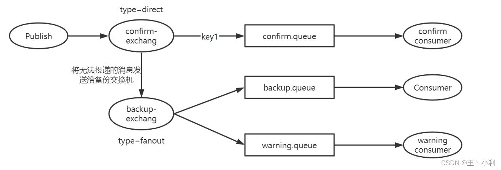

::: details 示例代码
::: tabs

@tab 配置类

```java
@Configuration
public class BingConf {

    public static final String CONFIRM_EXCHANGE = "confirm_exchange";

    public static final String CONFIRM_QUEUE = "confirm_queue";

    public static final String CONFIRM_ROTING_KEY = "confirm_routing_key";

    public static final String BACKUP_EXCHANGE = "backup_exchange";

    public static final String BACKUP_QUEUE = "backup_queue";

    public static final String WARNING_QUEUE = "warning_queue";


    @Bean("c_ex")
    public DirectExchange confirmChange(){
        return (DirectExchange)ExchangeBuilder.directExchange(CONFIRM_EXCHANGE).
                withArgument("alternate-exchange",BACKUP_EXCHANGE)
                                              .build();
    }

    @Bean("b_ex")
    public FanoutExchange backupChange(){
        return new FanoutExchange(BACKUP_EXCHANGE);
    }

    @Bean("c_qu")
    public Queue confirmQueue(){
        return QueueBuilder.durable(CONFIRM_QUEUE).build();
    }

    @Bean("b_qu")
    public Queue backupQueue(){
        return QueueBuilder.durable(BACKUP_QUEUE).build();
    }

    @Bean("w_qu")
    public Queue warningQueue(){
        return QueueBuilder.durable(WARNING_QUEUE).build();
    }

    @Bean()
    public Binding bindingQueueAndExchange(@Qualifier("c_ex") DirectExchange exchange,
                                           @Qualifier("c_qu") Queue queue){
        return BindingBuilder.bind(queue).to(exchange).with(CONFIRM_ROTING_KEY);
    }

    @Bean()
    public Binding bindingBackupQueueAndBackupExchange(@Qualifier("b_ex") FanoutExchange exchange,
                                                 @Qualifier("b_qu") Queue backQueue){
        return BindingBuilder.bind(backQueue).to(exchange);
    }

    @Bean()
    public Binding bindingWarningQueueAndBackupExchange(@Qualifier("b_ex") FanoutExchange exchange,
                                                 @Qualifier("w_qu") Queue warningQueue){
        return BindingBuilder.bind(warningQueue).to(exchange);
    }
}
```

@tab 备份消费者

```java
@Slf4j
@Component
public class BackupConsumer {

    @RabbitListener(queues = BingConf.BACKUP_QUEUE)
    public void receiveConfirmMessage(Message message){
        log.info("备份消费者接收到消息：{}",new String(message.getBody(), StandardCharsets.UTF_8));
    }

}
```

@tab 报警消费者

```java
@Slf4j
@Component
public class WarningConsumer {

    @RabbitListener(queues = BingConf.WARNING_QUEUE)
    public void receiveConfirmMessage(Message message) {
        log.info("报警消费者接收到消息：{}", new String(message.getBody(), StandardCharsets.UTF_8));
    }

}
```

:::

注：当回退消息和备份交换机在配置文件application.properties同时存在时，**优先使用备份交换机**

## 其它知识点

### 幂等性

用户对于同一操作发起的一次请求或者多次请求的结果是一致的，不会因为多次点击而产生了副作用。

用户购买商品后支付，支付扣款成功，但是返回结果的时候网络异常，此时钱已经扣了，用户再次点击按钮，此时会进行第二次扣款，返回结果成功，用户查询余额发现多扣钱了，流水记录也变成了两条。在以前的单应用系统中，我们只需要把数据操作放入事务中即可，发生错误立即回滚，但是再响应客户端的时候也有可能出现网络中断或者异常等等。

**消息重复消费：**

消费者在消费MQ中的消息时，MQ已把消息发送给消费者，消费者在给MQ 返回 ack 时网络中断，故MQ未收到确认信息，该条消息会重新发给其他的消费者，或者在网络重连后再次发送给该消费者，但实际上该消费者已成功消费了该条消息，造成消费者消费了重复的消息。

**解决思路：**

MQ消费者的幂等性的解决一般使用全局ID、唯一标识（比如时间戳）、UUID，订单消费者每次消费消息时用该 id 先判断该消息是否已消费过。

**消费端的幂等性保障：**

在海量订单生成的业务高峰期，生产端有可能会重复发出消息，这时候消费端就要实现幂等性，这就意味着即使收到了一样的消息，消息永远不会被消费多次。

业界主流的幂等性有两种操作：

1. 唯一 ID+指纹码机制，利用数据库主键去重

   > 指纹码：一些规则或者时间戳加别的服务给到的唯一信息码，它并不一定是系统生成的，基本都是由业务规则拼接而来，但是一定要保证唯一性，然后判断这个 id 是否存在数据库中，优势就是实现简单就一个拼接，查询判断是否重复；劣势就是在高并发时，如果是单个数据库就会有写入性能瓶颈，也可以采用分库分表提升性能，但不是最推荐的方式。

1. 利用 redis 的原子性去实现

   > 利用 redis 执行 setnx 命令，天然具有幂等性。从而实现不重复消费。

### 优先级队列

比如在系统中有一个订单催付的场景，客户在天猫下订单，如果在设定的时间内未付款，那么就会给客户推送一条短信提醒。比如像苹果，小米这样大商家，他们的订单得到优先处理，redis的定时轮询只能用List做一个简简单单的消息队列，并不能实现一个优先级的场景。

订单量大了后采用 RabbitMQ 进行改造和优化，如果发现是大商家的订单给一个相对比较高的优先级，否则就是默认优先级。

**添加优先级队列**

要让队列实现优先级需要做的事情：

1. 队列需要设置为优先级队列
2. 需要设置消息的优先级
3. 消费者需要等待消息已经发送到队列中才去消费，这样才有机会对消息进行排序

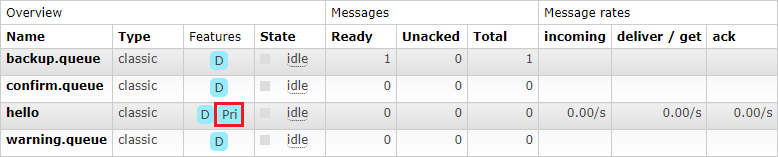

**控制台页面添加**

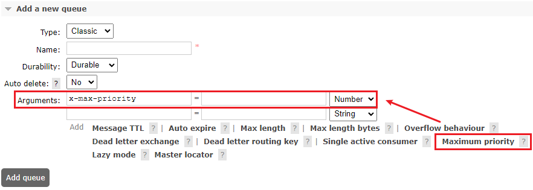

**代码中队列添加**

```java
Map<String, Object> params = new HashMap();
params.put("x-max-priority", 10);
channel.queueDeclare("hello", true, false, false, params);

```

**代码中消息添加**

```java
AMQP.BasicProperties properties = new AMQP.BasicProperties().builder().priority(5).build();
```

**案例**

消息发布者：

```java
public class Producer {
    private static final String QUEUE_NAME = "hello";

    public static void main(String[] args) throws Exception {
        Channel channel = RabbitMqUtils.getChannel();
         // 设置队列的最大优先级 最大可以设置到 255 官网推荐 1-10 如果设置太高比较吃内存和 CPU
        Map<String, Object> params = new HashMap();
        params.put("x-max-priority", 10);
        channel.queueDeclare(QUEUE_NAME, true, false, false, params);
        // 给消息赋予一个 priority 属性
        AMQP.BasicProperties properties = new AMQP.BasicProperties().builder().priority(5).build();
        for (int i = 1; i <= 10; i++) {
            String message = "info" + i;
            if (i == 5) {
                channel.basicPublish("", QUEUE_NAME, properties, message.getBytes());
            } else {
                channel.basicPublish("", QUEUE_NAME, null, message.getBytes());
            }
            System.out.println("发送消息完成:" + message);
        }
    }
}

```

消息接受者：

```java
public class Consumer {
    private static final String QUEUE_NAME = "hello";

    public static void main(String[] args) throws Exception {
        Channel channel = RabbitMqUtils.getChannel();
      
        System.out.println("消费者启动等待消费..............");
        DeliverCallback deliverCallback = (consumerTag, delivery) -> {
            String receivedMessage = new String(delivery.getBody());
            System.out.println("接收到消息:" + receivedMessage);
        };
        channel.basicConsume(QUEUE_NAME, true, deliverCallback, (consumerTag) -> {
            System.out.println("消费者无法消费消息时调用，如队列被删除");
        });
    }
}

```

### 惰性队列

RabbitMQ 从 3.6.0 版本开始引入了惰性队列的概念。

惰性队列会尽可能的将消息存入磁盘中，而在消费者消费到相应的消息时才会被加载到内存中，它的一个重要的设计目标是能够支持更长的队列，即支持更多的消息存储。当消费者由于各种各样的原因(比如消费者下线、宕机亦或者是由于维护而关闭等)而致使长时间内不能消费消息造成堆积时，惰性队列就很有必要了。

默认情况下，生产者将消息发送到 RabbitMQ 的时候，队列中的消息会尽可能的存储在内存之中，这样可以更加快速的将消息发送给消费者。即使是持久化的消息，在被写入磁盘的同时也会在内存中驻留一份备份。当 RabbitMQ 需要释放内存的时候，会将内存中的消息换页至磁盘中，这个操作会耗费较长的时间，也会阻塞队列的操作，进而无法接收新的消息。

虽然 RabbitMQ 的开发者们一直在升级相关的算法，但是效果始终不太理想，尤其是在消息量特别大的时候。

**两种模式**

**队列具备两种模式：default 和 lazy。**

 默认的为default 模式，在3.6.0 之前的版本无需做任何变更。lazy模式即为惰性队列的模式，可以通过调用channel.queueDeclare方法的时候在参数中设置，也可以通过Policy的方式设置，如果一个队列同时使用这两种方式设置的话，那么Policy的方式具备更高的优先级。

如果要通过声明的方式改变已有队列的模式的话，那么只能先删除队列，然后再重新声明一个新的。

在队列声明的时候可以通过x-queue-mode参数来设置队列的模式，取值为default和lazy。

```java
Map<String, Object> args = new HashMap<String, Object>();
args.put("x-queue-mode", "lazy");
channel.queueDeclare("myqueue", false, false, false, args);

```

**内存开销对比**


在发送一百万条消息，每条消息大概占1KB的情况下，普通队列占用内存是1.2GB，而惰性队列仅仅占用1.5MB。

## RabbitMQ集群

###  集群形式

#### 普通模式(默认)

对于普通模式， **集群中各节点有相同的队列结构**， 但**消息只会存在于集群中的一个节点**。 对于消费者来说， 若消息进入 A 节点的 Queue 中， 当从 B 节点拉取时， RabbitMQ 会将消息从 A 中取出， 并经过 B 发送给消费者。

> 应用场景： **该模式各适合于消息无需持久化的场合**， 如日志队列。 当队列非持久化， 且创建该队列的节点宕机， 客户端才可以重连集群其他节点， 并重新创建队列。 **若为持久化，只能等故障节点恢复**。

##### 搭建(Docker)

###### 首先创建容器映射目录

```sh
#创建rabbitmq用于存放rabbitmq集群映射信息
mkdir /mydata/rabbitmq
#分别创建各集群映射目录
cd rabbitmq/
mkdir rabbitmq01 rabbitmq02 rabbitmq03

```

###### 启动集群镜像容器

rabbitmq01：15673

```sh
docker run -d --hostname rabbitmq01 --name rabbitmq01 -v /mydata/rabbitmq/rabbitmq01:/var/lib/rabbitmq -p 15673:15672 -p 5673:5672 -e RABBITMQ_ERLANG_COOKIE='zr' rabbitmq:3.8.2-management
```

rabbitmq02： 15674

```sh
docker run -d --hostname rabbitmq02 --name rabbitmq02 -v/mydata/rabbitmq/rabbitmq02:/var/lib/rabbitmq -p 15674:15672 -p 5674:5672 -e RABBITMQ_ERLANG_COOKIE='zr' --link rabbitmq01:rabbitmq01 rabbitmq:3.8.2-management
```

rabbitmq03： 15675

```sh
docker run -d --hostname rabbitmq03 --name rabbitmq03 -v /mydata/rabbitmq/rabbitmq03:/var/lib/rabbitmq -p 15675:15672 -p 5675:5672 -e RABBITMQ_ERLANG_COOKIE='zr' --link rabbitmq01:rabbitmq01 --link rabbitmq02:rabbitmq02 rabbitmq:3.8.2-management
```

> 注意事项:
>
> –hostname 设置容器的主机名
>
> RABBITMQ_ERLANG_COOKIE 节点认证作用， 部署集成时 需要同步该值
>
> RABBITMQ_ERLANG_COOKIE 为rabbitmq多节点之间通信所用到的cookie，rabbitmq集群就是利用这一特性实现的

###### 节点加入集群

> 设置rabbitmq01为主节点

```sh
docker exec -it rabbitmq01 /bin/bash
rabbitmqctl stop_app
rabbitmqctl reset
rabbitmqctl start_app
exit

```

> 将rabbitmq02加入rabbitmq01

```sh
docker exec -it rabbitmq02 /bin/bash
rabbitmqctl stop_app
rabbitmqctl reset
rabbitmqctl join_cluster --ram rabbit@rabbitmq01
rabbitmqctl start_app
exit
```

> 将rabbitmq02加入rabbitmq01

```sh
docker exec -it rabbitmq03 bash
rabbitmqctl stop_app
rabbitmqctl reset
rabbitmqctl join_cluster --ram rabbit@rabbitmq01
rabbitmqctl start_app
exit
```

> 最后能看到其他节点信息也就成功了(普通模式)


#### 镜像模式

**与普通模式不同之处是消息实体会主动在镜像节点间同步， 而不是在取数据时临时拉取**， 高可用； 该模式下， mirror queue 有一套选举算法， 即 1 个 master、 n 个 slaver， **生产者、 消费者的请求都会转至 master**。

> 应用场景： 可靠性要求较高场合， 如下单、 库存队列。
> 缺点： 若镜像队列过多， 且消息体量大， 集群内部网络带宽将会被此种同步通讯所消耗。
> （1） 镜像集群也是基于普通集群， 即只有先搭建普通集群， 然后才能设置镜像队列。
> （2） 若消费过程中， master 挂掉， 则选举新 master， 若未来得及确认， 则可能会重复消费。

##### 搭建

> 在普通模式集群的条件下才能搭建镜像集群,并且需要选择一个主节点,此处我们选择rabbitmq01为主节

```sh
#进入rabbitmq01容器
docker exec -it rabbitmq01 bash
```

> 首先查看此时的策略什么,发现为空,默认普通模式

```sh
rabbitmqctl list_policies -p /
```

> 增加镜像模式策略
>
> ha-mode：  all 即复制到所有节点， 包含新增节点。exactly 是指定模式，为exactly时可以指定ha-params ，这个值为备份指定份数
>
> 策略正则表达式为 “^” 表示所有匹配所有队列名称，“^hello”表示只匹配名为 hello 开始的队列

```sh
rabbitmqctl set_policy -p / ha "^" '{"ha-mode":"all","ha-sync-mode":"automatic"}'
```

> 查看此时的策略

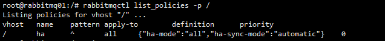

**镜像模式由于是同步的,当rabbitma01宕机后客户端是直接可以向其他节点拿到消息的**

### HAPROXY+KEEPALIVED实现高可用的负载均衡

#### 架构图

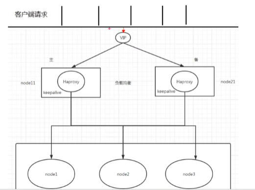

#### Haproxy实现负载均衡

[参考资料1](https://www.bbsmax.com/A/pRdBPZ36Jn/)

[参考资料2](https://blog.csdn.net/li68686/article/details/110127607/)

##### 下载haproxy

[Haproxy国内镜像](https://src.fedoraproject.org/repo/pkgs/haproxy/)

查看内核版本：

```sh
uname -r
```

根据内核版本选择编译参数：

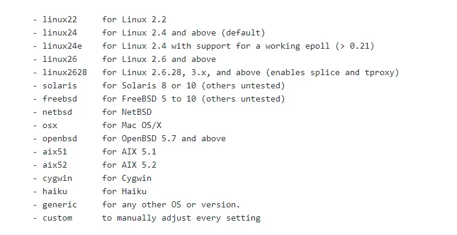

这里内核是3.10的选择 linux2628，安装haproxy

```sh
useradd -r haproxy
wget https://src.fedoraproject.org/repo/pkgs/haproxy/haproxy-1.8.12.tar.gz/sha512/2b782a54988cc88d1af0e5f011af062910e8fac28eab13db7e05a58d0d23961f827da47e3871e8d081f5a2d222588480d81dec2e9f14ec9f54a1c3cb5bf3d56a/haproxy-1.8.12.tar.gz
tar -zxvf haproxy-1.8.12.tar.gz
cd  haproxy-1.8.12
make TARGET=linux2628 PREFIX=/usr/local/haproxy
make install PREFIX=/usr/local/haproxy
cd /usr/local/haproxy
chown -R haproxy.haproxy *
```

或者

```sh
yum -y install haproxy
```

安装成功后，查看版本：

```sh
/usr/local/haproxy/sbin/haproxy -v
```

##### 配置Haproxy

HAProxy配置文件通常分为三个部分，即global、defaults和listen。global为全局配置，defaults为默认配置，listen为应用组件配置。

global为全局配置部分，属于进程级别的配置，通常和使用的操作系统配置相关。

defaults配置项配置默认参数，会被应用组件继承，如果在应用组件中没有特别声明，将使用默认配置参数。

以配置RabbitMQ集群的负载均衡为例，在安装目录下面新建一个haproxy.cfg，输入下面配置信息：

```
cd /usr/local/haproxy
touch haproxy.cfg
```

配置内容为:

```sh
global
  #日志输出配置，所有日志都记录在本机，通过local0输出
  log 127.0.0.1 local0 info
  #最大连接数
  maxconn 10240
  #以守护进程方式运行
  daemon
defaults
  #应用全局的日志配置
  log global
  mode http
  #超时配置
  timeout connect 5000
  timeout client 5000
  timeout server 5000
  timeout check 2000
listen http_front #haproxy的客户页面
  bind 0.0.0.0:8888
  mode http
  option httplog
  stats uri /haproxy
  stats auth admin:123456
  stats refresh 5s
  stats enable
listen haproxy #负载均衡的名字
  bind 0.0.0.0:5666 #对外提供的虚拟的端口
  option tcplog
  mode tcp
  #轮询算法
  balance roundrobin
  server rabbit1 1.117.149.141:5673 check inter 5000 rise 2 fall 2
  server rabbit2 1.117.149.141:5674 check inter 5000 rise 2 fall 2
  server rabbit3 1.117.149.141:5675 check inter 5000 rise 2 fall 2
```

启动：

```
/usr/local/haproxy/sbin/haproxy -f /usr/local/haproxy/haproxy.cfg
```

进入管理页面：

```
http://ip:8888/haproxy
账户:admin
密码:123456
```

#### KeepAlived配置高可用

Keepalived，它是一个高性能的服务器高可用或热备解决方案，Keepalived主要来防止服务器单点故障的发生问题，可以通过其与Nginx、Haproxy等反向代理的负载均衡服务器配合实现web服务端的高可用。Keepalived以VRRP协议为实现基础，用VRRP协议来实现高可用性（HA）。

##### 下载KeepAlived

Keepalived的官网下载Keepalived的安装文件，，下载地址为http://www.keepalived.org/download.html。

```sh
wget -c --no-check-certificate https://www.keepalived.org/software/keepalived-2.2.7.tar.gz
tar zxvf keepalived-2.2.7.tar.gz
cd keepalived-2.2.7
./configure --prefix=/opt/keepalived --with-init=SYSV
#注：(upstart|systemd|SYSV|SUSE|openrc) #根据你的系统选择对应的启动方式
make && make install

```

##### 配置KeepAlived

```sh
cp /opt/keepalived/etc/rc.d/init.d/keepalived /etc/init.d/
cp /opt/keepalived/etc/sysconfig/keepalived /etc/sysconfig
cp /opt/keepalived/sbin/keepalived /usr/sbin/
chmod +x /etc/init.d/keepalived
chkconfig --add keepalived
chkconfig keepalived on
#Keepalived默认会读取/etc/keepalived/keepalived.conf配置文件
mkdir /etc/keepalived
cp /opt/keepalived/etc/keepalived/keepalived.conf /etc/keepalived/
```

接下来修改/etc/keepalived/keepalived.conf文件，在Keepalived的Master上配置详情如下：

```
! Configuration File for keepalived
#Keepalived配置文件
global_defs {
        router_id NodeA                 #路由ID, 主备的ID不能相同
}
#自定义监控脚本
vrrp_script chk_haproxy {
        script "/etc/keepalived/check_haproxy.sh"
        interval 5
        weight 2
}
vrrp_instance VI_1 {
        state MASTER #Keepalived的角色。Master表示主服务器，从服务器设置为BACKUP
        interface eth0          #指定监测网卡
        virtual_router_id 1
        priority 100            #优先级，BACKUP机器上的优先级要小于这个值
        advert_int 1            #设置主备之间的检查时间，单位为s
        authentication {        #定义验证类型和密码
                auth_type PASS
                auth_pass root123
        }
        track_script {
                chk_haproxy
        }
        virtual_ipaddress {     #VIP地址，可以设置多个：
                1.117.149.141
        }
}
```

启动

```sh
service keepalived start
```

### Federation Exchange(联邦交换机)

#### 为什么使用联邦交换机

  (broker 北京)，(broker 深圳)彼此之间相距甚远，网络延迟是一个不得不面对的问题。有一个在北京 的业务(Client 北京) 需要连接(broker 北京)，向其中的交换器 exchangeA 发送消息，此时的网络延迟很小， (Client 北京)可以迅速将消息发送至 exchangeA 中，就算在开启了 publisherconfirm 机制或者事务机制的 情况下，也可以迅速收到确认信息。此时又有个在深圳的业务(Client 深圳)需要向 exchangeA 发送消息， 那么(Client 深圳) (broker 北京)之间有很大的网络延迟，(Client 深圳) 将发送消息至 exchangeA 会经历一 定的延迟，尤其是在开启了 publisherconfirm 机制或者事务机制的情况下，(Client 深圳) 会等待很长的延 迟时间来接收(broker 北京)的确认信息，进而必然造成这条发送线程的性能降低，甚至造成一定程度上的 阻塞。

  将业务(Client 深圳)部署到北京的机房可以解决这个问题，但是如果(Client 深圳)调用的另些服务都部 署在深圳，那么又会引发新的时延问题，总不见得将所有业务全部部署在一个机房，那么容灾又何以实现？ 这里使用 Federation 插件就可以很好地解决这个问题.

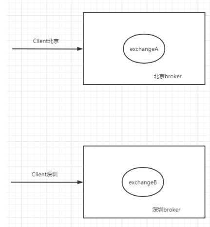

#### 搭建步骤

##### 需要保证每台节点单独运行

##### 在每台机器上开启federation相关插件

```sh
rabbitmq-plugins enable rabbitmq_federation
rabbitmq-plugins enable rabbitmq_federation_management
```

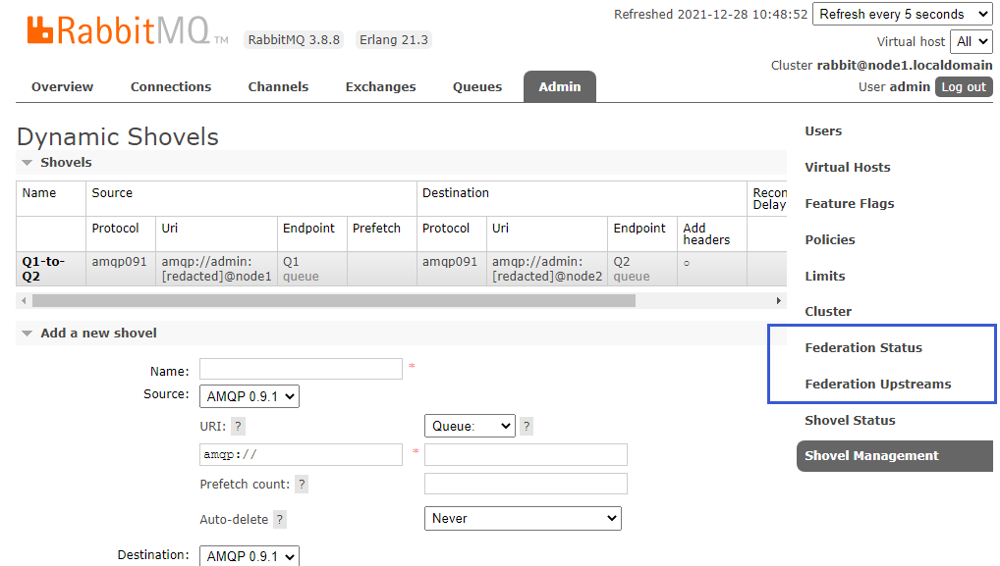

##### 原理图(先运行consumer在node2创建fed_exchange)

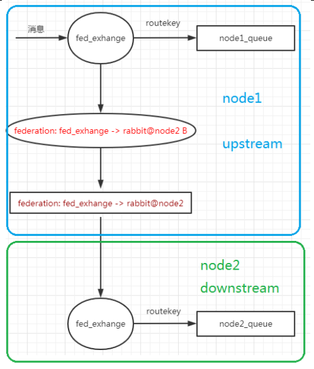

消费者代码：

```java
public class Consumer {

    //队列的名称
    public static final String QUEUE_NAME="mirrior_hello";
    //交换机的名称
    public static final String FED_EXCHANGE="fed_exchange";
    //接收消息
    public static void main(String[] args) throws IOException, TimeoutException {
        //创建连接工厂
        ConnectionFactory factory=new ConnectionFactory();
        factory.setHost("192.168.159.34");
        factory.setUsername("admin");
        factory.setPassword("123");
        Connection connection = factory.newConnection();

        Channel channel = connection.createChannel();

        channel.exchangeDeclare(FED_EXCHANGE,BuiltinExchangeType.DIRECT);
        channel.queueDeclare("node2_queue",true,false,false,null);
        channel.queueBind("node2_queue",FED_EXCHANGE,"routeKey");

        //声明 接收消息
        DeliverCallback deliverCallback=(consumerTag, message)->{
            System.out.println(new String(message.getBody()));
        };
        //取消消息时的回调
        CancelCallback cancelCallback=consumerTag -> {
            System.out.println("消息消费被中断");
        };


        /**
         * 消费者消费消息
         * 1.消费哪个队列
         * 2.消费成功之后是否要自动应答 true代表自动应答 false手动应答
         * 3.消费者成功消费的回调
         * 4.消费者取消消费的回调
         */
        channel.basicConsume(QUEUE_NAME,true,deliverCallback,cancelCallback);

    }
}
```

##### 在downstream(node2)配置upstream(node1)

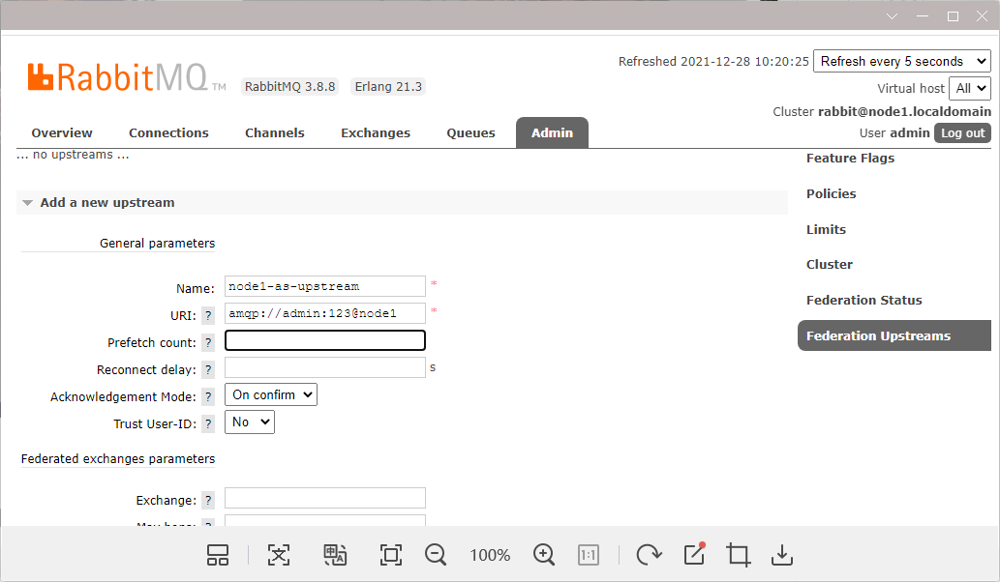

##### 添加policy

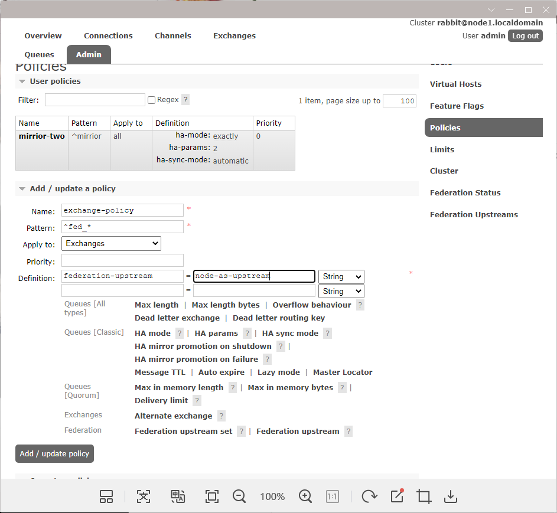

查看下是否搭建成功，点击**Federation Status**

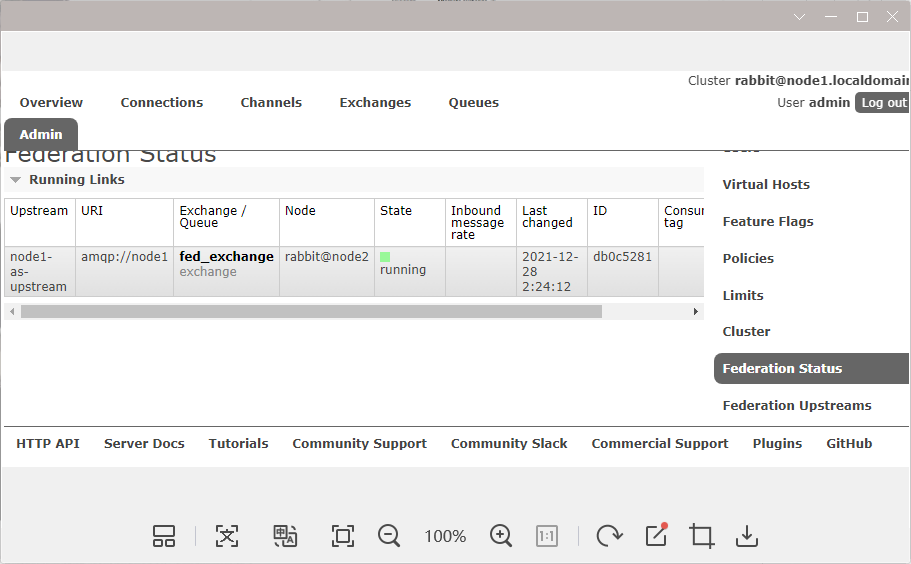

##### 查看下是否搭建成功，点击**Federation Status**


### Federation Queue(联邦队列)

#### 为什么使用联邦队列

联邦队列可以在多个 Broker 节点(或者集群)之间为单个队列提供均衡负载的功能。一个联邦队列可以 连接一个或者多个上游队列(upstream queue)，并从这些上游队列中获取消息以满足本地消费者消费消息 的需求。

#### 搭建步骤

##### 原理图

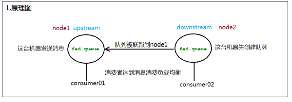

##### 添加upstream


##### 添加policy

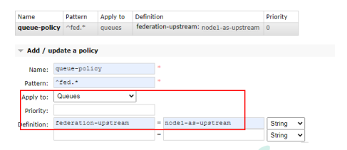

### Shovel

#### 为什么使用Shovel

Federation 具备的数据转发功能类似，Shovel 够可靠、持续地从一个 Broker 中的队列(作为源端，即 source)拉取数据并转发至另一个 Broker 中的交换器(作为目的端，即 destination)。作为源端的队列和作 为目的端的交换器可以同时位于同一个 Broker，也可以位于不同的 Broker 上。Shovel 可以翻译为"铲子"， 是一种比较形象的比喻，这个"铲子"可以将消息从一方"铲子"另一方。Shovel 行为就像优秀的客户端应用 程序能够负责连接源和目的地、负责消息的读写及负责连接失败问题的处理。

#### 搭建步骤

##### 开启的插件(需要的机器都开启)

```sh
rabbitmq-plugins enable rabbitmq_shovel
rabbitmq-plugins enable rabbitmq_shovel_management
```

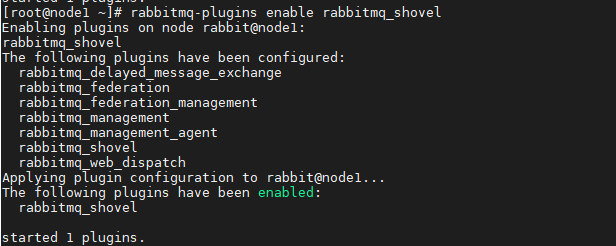

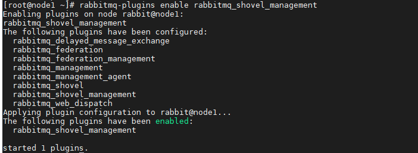

##### 原理图(在源头发送的消息直接会进入到目的地队列)

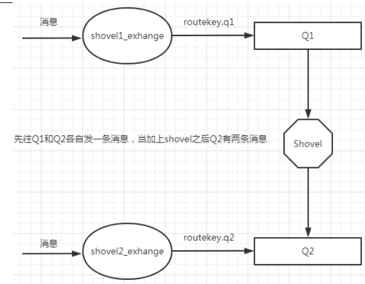

##### 添加shovel源和目的地

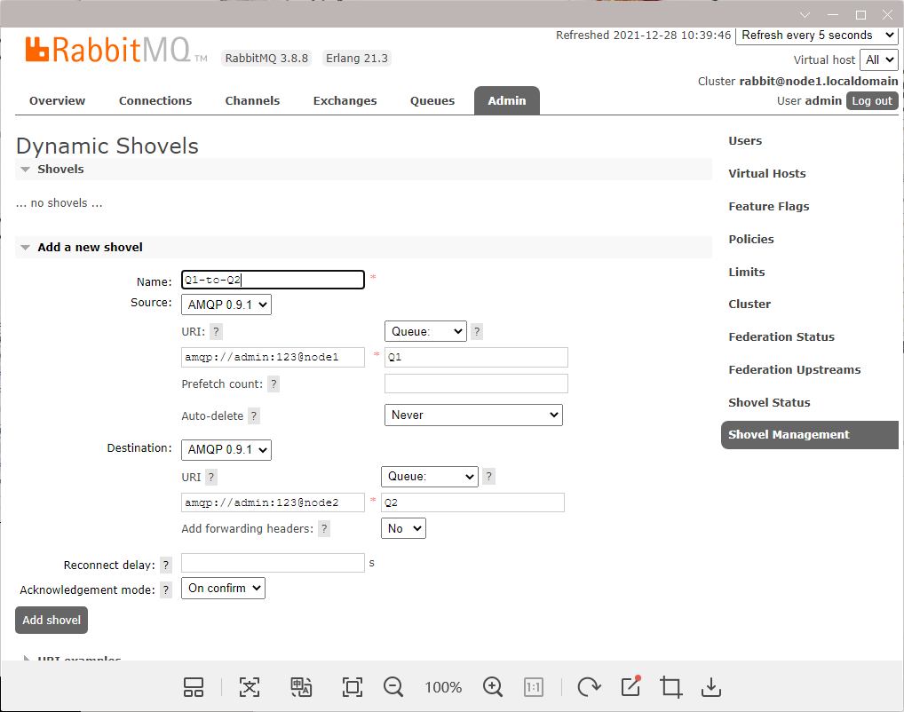

检查下是否搭建成功

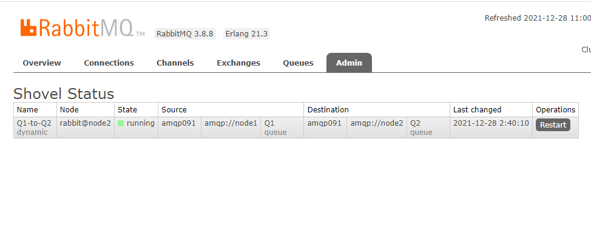
