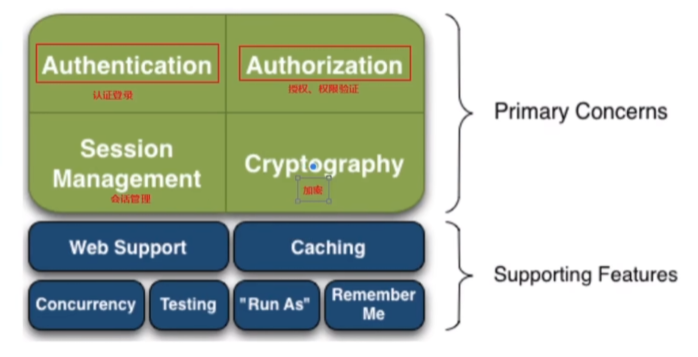
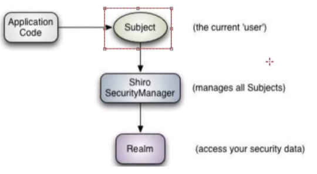
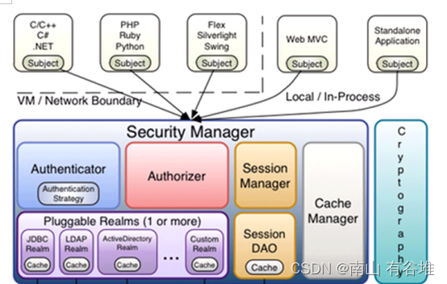

<!-- more -->

# Shiro学习笔记

## 入门

### Shiro介绍

Apache Shiro是一个强大且易用的Java安全框架,执行身份验证、授权、密码和会话管理。使用Shiro的易于理解的API,您可以快速、轻松地获得任何应用程序,从最小的移动应用程序到最大的网络和企业应用程序。

1. shiro是apache的一个开源框架，是一个权限管理的框架，实现 用户认证、用户授权。

2. spring中有spring security (原名Acegi)，是一个权限框架，它和spring依赖过于紧密，没有shiro使用简单。

3.  shiro不依赖于spring，shiro不仅可以实现 web应用的权限管理，还可以实现c/s系统，分布式系统权限管理，shiro属于轻量框架，越来越多企业项目开始使用shiro。

### 基本功能

- Authentication ： 认证登录
- Authorization： 授权、权限验证
- Session Management： 会话管理
- Cryptography： 加密
- Web Support： web相关
- Caching ： 缓存
- Concurrency： 并发校验
- Testing： 测试
- Run As ： 看作什么角色
- Remember Me： 记住

### 原理

从外部来看：

- Subject ： 对象、用户
- Shiro SecurityManager： 安全管理器
- Realm ： 安全信息也可以看作数据源)

从内部来看：

- **subject**：主体，可以是用户也可以是程序，主体要访问系统，系统需要对主体进行认证、授权。

- **securityManager**：安全管理器，主体进行认证和授权都是通过securityManager进行。securityManager是一个集合，真正做事的不是securityManager而是它里面的东西。

- **authenticator**：认证器，主体进行认证最终通过authenticator进行的。

- **authorizer**：授权器，主体进行授权最终通过authorizer进行的。

- **sessionManager**：web应用中一般是用web容器（中间件tomcat）对session进行管理，shiro也提供一套session管理的方式。shiro不仅仅可以用于web管理也可以用于cs管理，所以他不用web容器的session管理。

- **SessionDao**：  通过SessionDao管理session数据，针对个性化的session数据存储需要使用sessionDao（如果用tomcat管理session就不用SessionDao，如果要分布式的统一管理session就要用到SessionDao）。

- **cache Manager**：缓存管理器，主要对session和授权数据进行缓存（权限管理框架主要就是对认证和授权进行管理，session是在服务器缓存中的），比如将授权数据通过cacheManager进行缓存管理，和ehcache整合对缓存数据进行管理（redis是缓存框架）。

- **realm**：域，领域，相当于数据源，通过realm存取认证、授权相关数据（原来是通过数据库取的）。

  注意：authenticator认证器和authorizer授权器调用realm中存储授权和认证的数据和逻辑。

- **cryptography**：密码管理，比如md5加密，提供了一套加密/解密的组件，方便开发。比如提供常用的散列、加/解密等功能。比如 md5散列算法（md5只有加密没有解密）。

## 与SpringBoot整合

### // todo